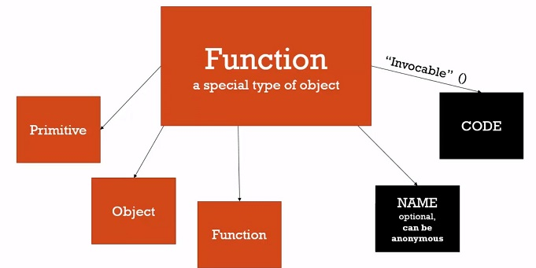
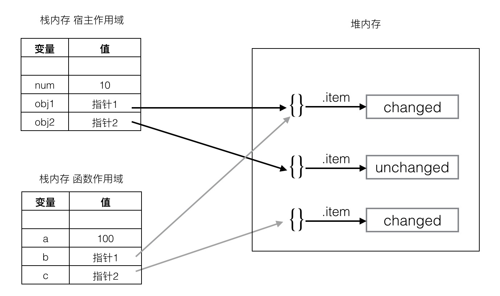

# Javascript Tutoriol

## Javascript的历史

### Javascript的诞生

1995年，Netscape公司雇佣了程序员Brendan Eich开发这种网页脚本语言。Brendan Eich有很强的函数式编程背景，希望以Scheme语言（函数式语言鼻祖LISP语言的一种方言）为蓝本，实现这种新语言。

1995年5月，Brendan Eich只用了10天，就设计完成了这种语言的第一版。它是一个大杂烩，语法有多个来源：

* 基本语法：借鉴C语言和Java语言。
* 数据结构：借鉴Java语言，包括将值分成原始值和对象两大类。
* 函数的用法：借鉴Scheme语言和Awk语言，将函数当作第一等公民，并引入闭包。
* 原型继承模型：借鉴Self语言（Smalltalk的一种变种）。
* 正则表达式：借鉴Perl语言。
* 字符串和数组处理：借鉴Python语言。

对于其他语言，你需要学习语言的各种功能，而对于JavaScript，你常常需要学习各种解决问题的模式。而且由于来源多样，从一开始就注定，JavaScript的编程风格是函数式编程和面向对象编程的一种混合体

### JavaScript与ECMAScript的关系

1996年11月，Netscape公司决定将JavaScript提交给国际标准化组织ECMA（European Computer Manufacturers Association），希望JavaScript能够成为国际标准。

1997年7月，ECMA组织发布262号标准文件（ECMA-262）的第一版，规定了浏览器脚本语言的标准，并将这种语言称为ECMAScript。这个版本就是ECMAScript 1.0版。

ECMAScript只用来标准化JavaScript这种语言的基本语法结构，与部署环境相关的标准都由其他标准规定，比如DOM的标准就是由W3C组织（World Wide Web Consortium）制定的。

### JavaScript与Java的关系

JavaScript和Java是两种不一样的语言，但是它们之间存在联系。

JavaScript的基本语法和对象体系，是模仿Java而设计的。但是，JavaScript没有采用Java的静态类型。正是因为JavaScript与Java有很大的相似性，所以这门语言才从一开始的LiveScript改名为JavaScript。基本上，JavaScript这个名字的原意是“很像Java的脚本语言”。

在JavaScript语言中，函数是一种独立的数据类型，以及采用基于原型对象（prototype）的继承链。这是它与Java语法最大的两点区别。JavaScript语法要比Java自由得多。


### JavaScript的版本

1997年7月，ECMAScript 1.0发布。

1998年6月，ECMAScript 2.0版发布。

1999年12月，ECMAScript 3.0版发布，成为JavaScript的通行标准，得到了广泛支持。

2008年7月，由于对于下一个版本应该包括哪些功能，各方分歧太大，争论过于激进，ECMA开会决定，中止ECMAScript 4.0的开发（即废除了这个版本），将其中涉及现有功能改善的一小部分，发布为ECMAScript 3.1，而将其他激进的设想扩大范围，放入以后的版本，由于会议的气氛，该版本的项目代号起名为Harmony（和谐）。会后不久，ECMAScript 3.1就改名为ECMAScript 5。ECMAScript 5会在2013年的年中成为JavaScript开发的主流标准。


## Javascript语法

### 1. 语句

JavaScript程序的执行单位为行（line），也就是一行一行地执行。一般情况下，每一行就是一个语句。

语句（statement）是为了完成某种任务而进行的操作，比如下面就是一行赋值语句：

```javascript
var a = 1 + 3;
```

这条语句先用```var```命令，声明了变量```a``` ，然后将```1 + 3```的运算结果赋值给变量 ```a```

其中```1 + 3```叫做表达式（expression），指一个为了得到返回值的计算式。语句和表达式的区别在于，前者主要为了进行某种操作，一般情况下不需要返回值；后者则是为了得到返回值，一定会返回一个值。

凡是JavaScript语言中预期为值的地方，都可以使用表达式。比如，赋值语句的等号右边，预期是一个值，因此可以放置各种表达式。一条语句可以包含多个表达式。

语句以分号结尾，一个分号就表示一个语句结束。多个语句可以写在一行内。

```javascript
var a = 1 + 3 ; var b = 'abc';
```

分号前面可以没有任何内容，JavaScript引擎将其视为空语句。下面的代码就表示3个空语句
```javascript
;;;
```

表达式不需要分号结尾。一旦在表达式后面添加分号，则JavaScript引擎就将表达式视为语句，这样会产生一些没有任何意义的语句。

```javascript
1 + 3;
'abc';
```

### 2. 变量

#### 2.1 概念

```javascript
var a = 1;
```

上面的代码先声明变量```a```，然后在变量```a```与数值1之间建立引用关系，也称为将数值1“赋值”给变量```a```。以后，引用变量a就会得到数值1。最前面的```var```，是变量声明命令。它表示通知解释引擎，要创建一个变量```a```。

```javascript
var a;
a // undefined
```
如果只是声明变量而没有赋值，则该变量的值是undefined。undefined是一个JavaScript关键字，表示“无定义”。

可以在同一条var命令中声明多个变量。

```javascript
var a, b, c;
```
JavaScript 是一种动态类型语言，也就是说，变量的类型没有限制，可以赋予各种类型的值。

```javascript
var a = 1;
a = 'hello';
```

如果使用var重新声明一个已经存在的变量，是无效的。但是，如果第二次声明的同时还赋值了，则会覆盖掉前面的值。

```javascript
var x = 1;
var x;
x // 1

/*-------------------------------*/

var x = 1;
var x = 2;

x // 2
```

#### 2.2 变量提升

JavaScript引擎的工作方式是，先解析代码，获取所有被声明的变量，然后再一行一行地运行。这造成的结果，就是所有的变量的声明语句，都会被提升到代码的头部，这就叫做变量提升（hoisting）。

```javascript
console.log(a);
var a = 1;

//等同于

var a;
console.log(a);
a = 1;
```

使用```console.log```方法，在控制台（console）显示变量```a```的值。这时变量```a```还没有声明和赋值，所以这是一种错误的做法，但是实际上不会报错。

#### 2.3 标识符

标识符（identifier）是用来识别具体对象的一个名称。最常见的标识符就是变量名，以及后面要提到的函数名。JavaScript语言的标识符对大小写敏感，所以```a```和```A```是两个不同的标识符。

标识符有一套命名规则，不符合规则的就是非法标识符。JavaScript引擎遇到非法标识符，就会报错。

>第一个字符，可以是任意Unicode字母（包括英文字母和其他语言的字母），以及美元符号```$```和下划线```_```

>第二个字符及后面的字符，除了Unicode字母、美元符号和下划线，还可以用数字0-9

```
1a  // 第一个字符不能是数字
23  // 同上
***  // 标识符不能包含星号
a+b  // 标识符不能包含加号
-d  // 标识符不能包含减号或连词线
```
中文是合法的标识符，可以用作变量名。

```javascript
var 临时变量 = 1;
```

>JavaScript有一些保留字，不能用作标识符：arguments、break、case、catch、class、const、continue、debugger、default、delete、do、else、enum、eval、export、extends、false、finally、for、function、if、implements、import、in、instanceof、interface、let、new、null、package、private、protected、public、return、static、super、switch、this、throw、true、try、typeof、var、void、while、with、yield。

#### 2.4 注释

源码中被JavaScript引擎忽略的部分就叫做注释，它的作用是对代码进行解释。Javascript提供两种注释：一种是单行注释，用//起头；另一种是多行注释，放在/\* 和 \*/之间

```javascript
// 这是单行注释

/*
 这是
 多行
 注释
*/
```

#### 2.5 区块

JavaScript使用大括号，将多个相关的语句组合在一起，称为“区块”（block）。

与大多数编程语言不一样，JavaScript的区块不构成单独的作用域（scope）。也就是说，区块中的变量与区块外的变量，属于同一个作用域。

```javascript
{
  var a = 1;
}

a // 1
```

上面代码在区块内部，声明并赋值了变量```a```，然后在区块外部，变量a依然有效，这说明区块不构成单独的作用域，与不使用区块的情况没有任何区别。所以，单独使用的区块在JavaScript中意义不大，很少出现。区块往往用来构成其他更复杂的语法结构，比如```for```、```if```、```while```、```function```等

#### 2.6 条件语句

条件语句提供一种语法构造，只有满足某个条件，才会执行相应的语句。JavaScript提供```if```结构和```switch```结构，完成条件判断。

##### 2.6.1 if 语句

```javascript
if (expression)
  statement;

// 或者

if (expression) statement;
```

上面是```if```结构的基本形式。需要注意的是，expression（表达式）必须放在圆括号中，表示对表达式求值。如果结果为```true```，就执行紧跟在后面的语句（statement）；如果结果为```false```，则跳过statement的部分。

如果想执行多个语句，必须在if的条件判断之后，加上大括号，表示代码块。建议总是在if语句中使用大括号，因为这样方便插入语句。

if代码块后面，还可以跟一个else代码块，表示不满足条件时，所要执行的代码。

```javascript
if (expression) {
  // then
} else {
  // else
}
```

多个if...else语句可以连写在一起

```javascript
if (expression) {
  // then
} else if(expression){
  // else
} else if(expression){
  // else
} else {

}
```

##### 2.6.2 switch 语句

多个```if...else```连在一起使用的时候，可以转为使用更方便的```switch```结构。

```javascript
switch (model) {
  case 'BMW':
    // ...
    break;
  case 'Benz':
    // ...
    break;
  default:
    // ...
}
```

上面代码根据变量```model```的值，选择执行相应的```case```。如果所有```case```都不符合，则执行最后的```default```部分。需要注意的是，每个```case```代码块内部的```break```语句不能少，否则会接下去执行
下一个```case```代码块，而不是跳出```switch```结构。

需要注意的是，```switch```语句后面的表达式与case语句后面的表示式，在比较运行结果时，采用的是严格相等运算符```===```，而不是相等运算符 ```==```

##### 2.6.3 三元运算符 ?:

JavaScript还有一个三元运算符（即该运算符需要三个运算子）```?:```，也可以用于逻辑判断。

```javascript
(condition) ? expr1 : expr2
```

上面代码中，如果```condition```为```true```，则返回```expr1```的值，否则返回```expr2```的值。

```javascript
(10 % 2 === 0) ? true : false;
```

这个三元运算符可以被视为if...else...的简写形式

```javascript
var myVar;
console.log(myVar
  ? 'myVar has a value'
  : 'myVar do not has a value'
)
```

#### 2.7 循环语句

循环语句用于重复执行某个操作，它有多种形式。

##### 2.7.1 while 循环

.```while```语句包括一个循环条件和一段代码块，只要条件为真，就不断循环执行代码块。

```javascript
while (expression) {
  statement;
}
```

```javascript
var i = 0;
var sum = 0;

while (i <= 100) {
  console.log('i当前为：' + i);
  sum += i;
  i += 1;
}
```

##### 2.7.2 for 循环

.```for```语句是循环命令的另一种形式，可以指定循环的起点、终点和终止条件。

```javascript
for (initialize; test; increment) {
  statement
}
```

.```for```语句后面的括号里面，有三个表达式。

* 初始化表达式（initialize）：确定循环的初始值，只在循环开始时执行一次。
* 测试表达式（test）：检查循环条件，只要为真就进行后续操作。
* 递增表达式（increment）：完成后续操作，然后返回上一步，再一次检查循环条件。

```javascript
var x = 3;
for (var i = 0; i < x; i++) {
  console.log(i);
}
```

```javascript
for ( ; ; ){
  console.log('Hello World');
}
//上面代码省略了for语句表达式的三个部分，结果就导致了一个无限循环。
```

##### 2.7.3 do...while 循环

```javascript
do {
  //code here
} while (expression);
```

##### 2.7.4 break语句和continue语句

代码中```break```语句和```continue```语句都具有跳转作用，可以让代码不按原有的顺序执行。

> ```break```语句用于跳出代码块或循环

> ```continue```语句用于立即终止本轮循环，返回循环结构的头部，开始下一轮循环。

```javascript
for (var i = 0; i < 5; i++) {
  console.log(i);
  if (i === 3)
    break;
}
```

```javascript
var i = 0;

while (i < 100){
  i++;
  if (i%2 === 0) continue;
  console.log('i当前为：' + i);
}
```

## 数据类型

### 1. 概述

JavaScript 语言的每一个值，都属于某一种数据类型。JavaScript 的数据类型，共有六种。

* 数值（number）：整数和小数（比如1和3.14）
* 字符串（string）：字符组成的文本（比如”Hello World”）
* 布尔值（boolean）：true（真）和false（假）两个特定值
* undefined：表示“未定义”或不存在，即由于目前没有定义，所以此处暂时没有任何值
* null：表示无值，即此处的值就是“无”的状态。
* 对象（object）：各种值组成的集合

数值、字符串、布尔值称为原始类型（primitive type）的值，即它们是最基本的数据类型，不能再细分了。

而将对象称为合成类型（complex type）的值，因为一个对象往往是多个原始类型的值的合成，可以看作是一个存放各种值的容器。

至于undefined和null，一般将它们看成两个特殊值。

对象又可以分成三个子类型。

* 狭义的对象（object）
* 数组（array）
* 函数（function）

狭义的对象和数组是两种不同的数据组合方式，而函数其实是处理数据的方法。JavaScript把函数当成一种数据类型，可以像其他类型的数据一样，进行赋值和传递，这为编程带来了很大的灵活性，体现了JavaScript作为“函数式语言”的本质。

### 2. typeof运算符

typeof运算符可以返回一个值的数据类型，可能有以下结果。

原始类型

```javascript
typeof 123 // "number"
typeof '123' // "string"
typeof false // "boolean"
```

函数

```javascript
function f() {}
typeof f
```

undefined

```javascript
typeof undefined
```

```javascript
if (typeof v === "undefined") {
  // 这个特点通常用在判断语句
}
```

object

```javascript
typeof window // "object"
typeof {} // "object"
typeof [] // "object"
typeof null // "object"
```

空数组```[]```的类型也是```object```，这表示在JavaScript内部，数组本质上只是一种特殊的对象。

由于历史原因, ```null```的类型也是```object```。1995年JavaScript语言的第一版，所有值都设计成32位，其中最低的3位用来表述数据类型，```object```对应的值是```000```。当时，只设计了五种数据类型（对象、整数、浮点数、字符串和布尔值），完全没考虑```null```，只把它当作```object```的一种特殊值，32位全部为0。这是```typeof null```返回```object```的根本原因。

这并不是说```null```就属于对象，本质上```null```是一个类似于```undefined```的特殊值。

### 3. null 和 undefined


JavaScript中 ```null```与```undefined```都可以表示“没有”,在```if```语句中，它们都会被自动转为```false```，相等运算符```==```甚至直接报告两者相等。

只不过```null```的特殊之处在于，JavaScript把它包含在对象类型（object）之中。

**注意，JavaScript的标识名区分大小写，所以undefined和null不同于Undefined和Null（或者其他仅仅大小写不同的词形），后者只是普通的变量名。**


### 4. 布尔值

布尔值代表“真”和“假”两个状态。“真”用关键字```true```表示，“假”用关键字```false```表示。布尔值只有这两个值。

下列运算符会返回布尔值：
* 两元逻辑运算符： && ，||
* 前置逻辑运算符： ! (Not)
* 相等运算符：===，!==，==，!=
* 比较运算符：>，>=，<，<=

如果JavaScript预期某个位置应该是布尔值，会将该位置上现有的值自动转为布尔值。转换规则是除了下面六个值被转为```false```，其他值都视为```true```

* undefined
* null
* false
* 0
* NaN
* ''

比如程序流程的控制语句中

```javascript
if ('') {
  console.log(true);
}
// 没有任何输出
```


## 数值

### 1. 概述

JavaScript 内部，所有数字都是以64位浮点数形式储存，即使整数也是如此。

```javascript
1 === 1.0
```
由于浮点数不是精确的值，所以涉及小数的比较和运算要特别小心。

```javascript
0.1 + 0.2 === 0.3
```

JavaScript 浮点数的64个二进制位，从最左边开始，有效数字第一位默认总是1，不保存在64位浮点数之中是这样组成的。

* 1位：符号位，0表示正数，1表示负数
* 第2位到第12位：指数部分
* 第13位到第64位：小数部分（即有效数字）

### 2. 数值的表示方法

JavaScript 的数值有多种表示方法，可以用字面形式直接表示，比如35（十进制）和0xFF（十六进制）

```javascript
123e3 // 123000
123e-3 // 0.123
```

JavaScript 在1.小数点前的数字多于21位。2.小数点后的零多于5个。 会自动将数值转为科学计数法表示。

```javascript
1234567890123456789012
// 1.2345678901234568e+21
123456789012345678901
// 123456789012345680000


0.0000003 // 3e-7

0.00003 // 0.00003
```

### 3. NaN

JavaScript中 ```NaN``` 是的特殊值，表示“非数字”（Not a Number），经常出现在将字符串解析成数字出错的场合。

```javascript
5 - 'x' // NaN
0 / 0 // NaN
```

.```NaN```不等于任何值，包括它本身。```NaN```与任何数（包括它自己）的运算，得到的都是```NaN```。

```javascript
NaN === NaN // false

NaN + 32 // NaN
NaN - 32 // NaN
NaN * 32 // NaN
NaN / 32 // NaN
```

可以用```isNaN```方法可以用来判断一个值是否为```NaN```

```javascript
isNaN(NaN) // true
isNaN(123) // false
```

但是，```isNaN```只对数值有效，如果传入其他值，会被先转成数值。比如，传入字符串的时候，字符串会被先转成```NaN```，所以最后返回```true```

### 4. parseInt()

可以用```parseInt```方法用于将字符串转为整数。

```javascript
parseInt(1.23) // 1
parseInt('8a') // 8
parseInt('12**') // 12
parseInt('12.34') // 12
```

### 5. parseFloat()

可以用```parseFloat```方法用于将字符串转为浮点数。

```javascript
parseFloat('3.14') // 3.14
parseFloat('3.14more non-digit characters') // 3.14
```

## 字符串

### 1.1 定义

字符串就是零个或多个排在一起的字符，放在单引号或双引号之中。

```javascript
'abc'
"abc"

'key = "value"'
"It's a long journey"
```

字符串默认只能写在一行内，分成多行将会报错。

### 1.2 转义

反斜杠（\）在字符串内有特殊含义，用来表示一些特殊字符，所以又称为转义符。

* \0 null（\u0000）
* \b 后退键（\u0008）
* \f 换页符（\u000C）
* \n 换行符（\u000A）
* \r 回车键（\u000D）
* \t 制表符（\u0009）
* \v 垂直制表符（\u000B）
* \' 单引号（\u0027）
* \" 双引号（\u0022）
* \ 反斜杠（\u005C）

```javascript
console.log('1\n 2')
```

### 1.3 字符串与数组

字符串可以被视为字符数组，因此可以使用数组的方括号运算符，用来返回某个位置的字符（位置编号从0开始）。

```javascript
var s = 'hello';
s[0] // "h"
s[1] // "e"
s[4] // "o"

// 直接对字符串使用方括号运算符
'hello'[1] // "e"
```

### 1.3 length属性

.```length```属性返回字符串的长度，该属性也是无法改变的。

```javascript
var s = 'hello';
s.length // 5

s.length = 3;
s.length // 5
```

## 对象

### 1. 概述

#### 1.1 生成方法

对象（object）是 JavaScript 语言的核心概念，也是最重要的数据类型。

什么是对象？简单说，对象就是一组“键值对”（key-value）的集合，是一种无序的复合数据集合。

```javascript
var o = {
    p1: 'Hello World',
    p2: 'World'
};
```

上面代码中，大括号就定义了一个对象，它被赋值给变量```o```。这个对象内部包含一个键值对（又称为“成员”），```p```是“键名”（成员的名称），字符串```Hello World```是“键值”（成员的值）。键名与键值之间用冒号分隔。如果对象内部包含多个键值对，每个键值对之间用逗号分隔。

#### 1.2 属性

对象的每一个“键名”又称为“属性”（property），它的“键值”可以是任何数据类型。如果一个属性的值为函数，通常把这个属性称为“方法”，它可以像函数那样调用。

```javascript
var o = {
  p: function (x) {
    return 2 * x;
  }
};

o.p(2)
// 4
```

对象的属性之间用逗号分隔，最后一个属性后面可以加逗号（trailing comma），也可以不加。

```javascript
var o = {
  p: 123,
  m: function () { ... },
}
```

属性可以动态创建，不必在对象声明时就指定。

```javascript
var obj = {};
obj.foo = 123;
obj.foo // 123
```

#### 1.2 对象的引用

如果不同的变量名指向同一个对象，那么它们都是这个对象的引用，也就是说指向同一个内存地址。修改其中一个变量，会影响到其他所有变量。

```javascript
var o1 = {};
var o2 = o1;

o1.a = 1;
o2.a // 1

o2.b = 2;
o1.b // 2
```

### 2. 属性的操作

#### 2.1 读取属性

读取对象的属性，有两种方法，一种是使用点运算符，还有一种是使用方括号运算符。

```javascript
var o = {
  p: 'Hello World'
};

o.p // "Hello World"
o['p'] // "Hello World"
```

#### 2.2 查看所有属性

查看一个对象本身的所有属性，可以使用```Object.keys```方法。

```javascript
var o = {
  key1: 1,
  key2: 2
};

Object.keys(o);
// ['key1', 'key2']
```


## 数组

### 1 数组的定义

数组（array）是按次序排列的一组值。每个值的位置都有编号（从0开始），整个数组用方括号表示。

```javascript
var arr = ['a', 'b', 'c'];
```

### 2 数组length属性

```javascript
var arr = ['a', 'b', 'c'];
arr.length //3
```

### 3 for...in循环和数组的遍历

```javascript
var a = [1, 2, 3];

for (var i in a) {
  console.log(a[i]);
}
// 1
// 2
// 3
```

但是，```for...in```不仅会遍历数组所有的数字键，还会遍历非数字键。

```javascript
var a = [1, 2, 3];
a.foo = true;

for (var key in a) {
  console.log(a[key]);
}
// 0
// 1
// 2
// true
```

## 运算符

运算符是处理数据的基本方法，用来从现有数据得到新的数据。JavaScript与其他编程语言一样，提供了多种运算符。

### 1. 加法运算符

加法运算符```+```是最常见的运算符之一，但是使用规则却相对复杂。因为在JavaScript语言里面，这个运算符可以完成两种运算，既可以处理算术的加法，也可以用作字符串连接，它们都写成```+```

```javascript
// 加法
1 + 1
true + true
1 + true

// 字符串连接
'1' + '1'
'1.1' + '1.1'
```

由于加法运算符是运行时决定到底执行那种运算，使用的时候必须很小心。

```javascript
'3' + 4 + 5
3 + 4 + '5'
```

加法运算符以外的其他算术运算符（比如减法、除法和乘法），都不会发生重载。它们的规则是：所有运算子一律转为数值，再进行相应的数学运算。

```javascript
1 - '2' // -1
1 * '2' // 2
1 / '2' // 0.5
```
```javascript
var now = new Date();
typeof (now + 1)
typeof (now - 1)
```

### 2. 算术运算符

JavaScript提供9个算术运算符，用来完成基本的算术运算。

* 加法运算符（Addition）：x + y
* 减法运算符（Subtraction）： x - y
* 乘法运算符（Multiplication）： x * y
* 除法运算符（Division）：x / y
* 余数运算符（Remainder）：x % y
* 自增运算符（Increment）：++x 或者 x++
* 自减运算符（Decrement）：--x 或者 x--
* 数值运算符（Convert to number）： +x
* 负数值运算符（Negate）：-x


#### 2.1 余数运算符

余数运算符（%）返回前一值运算值被后一值运算值除，所得的余数。需要注意的是，运算结果的正负号由第一个运算子的正负号决定。

```javascript
-1 % 2 // -1
1 % -2 //
```

#### 2.2 自增和自减运算符

自增和自减运算符，是一元运算符，只需要一个运算子。它们的作用是将运算子首先转为数值，然后加上1或者减去1。它们会修改原始变量

```javascript
var x = 1;
++x // 2
x // 2

--x // 1
x // 1
```

#### 2.3 数值运算符

数值运算符（+）同样使用加号，但是加法运算符是二元运算符（需要两个操作数），它是一元运算符（只需要一个操作数）。

数值运算符的作用在于可以将任何值转为数值

```javascript
+true // 1
+[] // 0
+{} // NaN
```

#### 2.4 赋值运算符

赋值运算符（Assignment Operators）用于给变量赋值。

最常见的赋值运算符，当然就是等号（=），表达式x = y表示将y的值赋给x。

除此之外，JavaScript还提供其他11个复合的赋值运算符。

```javascript
x += y // 等同于 x = x + y
x -= y // 等同于 x = x - y
x *= y // 等同于 x = x * y
x /= y // 等同于 x = x / y
x %= y // 等同于 x = x % y
x >>= y // 等同于 x = x >> y
x <<= y // 等同于 x = x << y
x >>>= y // 等同于 x = x >>> y
x &= y // 等同于 x = x & y
x |= y // 等同于 x = x | y
x ^= y // 等同于 x = x ^ y
```

### 3 比较运算符

比较运算符用于比较两个值，然后返回一个布尔值，表示是否满足比较条件。

```javascript
2 > 1 // true
```

比较运算符可以比较各种类型的值，不仅仅是数值。JavaScript 一共提供了8个比较运算符。

* == 相等
* === 严格相等
* != 不相等
* !== 严格不相等
* < 小于
* <= 小于或等于
* \> 大于
* \>= 大于或等于

#### 3.1 原始类型的值

两个原始类型的值的比较，除了相等运算符```==```和严格相等运算符```===```其他比较运算符都是先转成数值再比较。

```javascript
5 > '4' // true
```
**特殊情况，即任何值（包括NaN本身）与NaN比较，返回的都是false**

#### 3.2 对象

如果运算子是对象，会转为原始类型的值，再进行比较。算法是先调用valueOf方法；如果返回的还是对象，再接着调用toString方法。

#### 3.3 严格相等运算符

JavaScript 提供两种相等运算符：```==```和```===```

简单说，它们的区别是相等运算符```==```比较两个值是否相等，严格相等运算符```===```比较它们是否为“同一个值”。

如果两个值不是同一类型，严格相等运算符```===```直接返回false，而相等运算符```==```会将它们转化成同一个类型，再用严格相等运算符进行比较。

两个复合类型（对象、数组、函数）的数据比较时，不是比较它们的值是否相等，而是比较它们是否指向同一个对象。

#### 3.4 相等运算符

相等运算符比较相同类型的数据时，与严格相等运算符完全一样。

比较不同类型的数据时，相等运算符会先将数据进行类型转换，然后再用严格相等运算符比较。类型转换规则如下。

* 原始类型的值: 原始类型的数据会转换成数值类型再进行比较。
* 对象与原始类型值比较:对象与原始类型的值比较时，对象转化成原始类型的值，再进行比较。

```javascript
[1] == 1
[1] == '1'
[1] == true

'' == '0'           
0 == ''             
0 == '0'           

2 == true           
2 == false          

false == 'false'    
false == '0'        

false == undefined  
false == null       
null == undefined   

' \t\r\n ' == 0     
```
上面这些表达式都很容易出错，因此不要使用相等运算符（==），最好只使用严格相等运算符（===）。

#### 3.5 undefined 和 null

.```undefined```和```null```与其他类型的值比较时，结果都为```false```，它们互相比较时结果为```true```

```javascript
undefined === undefined // true
null === null // true

undefined == null
```

### 4 布尔运算符

布尔运算符用于将表达式转为布尔值，一共包含四个运算符。

* 取反运算符：```!```
* 且运算符：```&&```
* 或运算符：```||```
* 三元运算符：```?:```

#### 4.1 取反运算符

取反运算符形式上是一个感叹号，用于将布尔值变为相反值，即```true```变成```false```，```false```变成```true```

对于非布尔值的数据，取反运算符会自动将其转为布尔值,规则是，以下六个值取反后为```true```

```javascript
!undefined // true
!null // true
!0 // true
!NaN // true
!"" // true
```
```javascript
!54 // false
!'hello' // false
![] // false
!{} // false
```

#### 4.2 且运算符

且运算符的运算规则是：如果第一个运算子的布尔值为```true```，则返回第二个运算子的值；如果第一个运算子的布尔值为```false```，则直接返回第一个运算子的值，且不再对第二个运算子求值。

```javascript
't' && '' //
't' && 'f' //
't' && (1 + 2) //
'' && 'f' //
```

且运算符可以多个连用，这时返回第一个布尔值为false的表达式的值。

#### 4.3 或运算符

或运算符的运算规则是：如果第一个运算子的布尔值为```true```，则返回第一个运算子的值，且不再对第二个运算子求值；如果第一个运算子的布尔值为```false```，则返回第二个运算子的值。

```javascript
't' && '' //
't' && 'f' //
't' && (1 + 2) //
'' && 'f' //
```

或运算符可以多个连用，这时返回第一个布尔值为true的表达式的值。

#### 4.4 三元条件运算符

三元条件运算符用问号（?）和冒号（:），分隔三个表达式。如果第一个表达式的布尔值为true，则返回第二个表达式的值，否则返回第三个表达式的值。

```javascript
console.log(true ? 'T' : 'F');
```

### 5 位运算符


###  圆括号的作用

圆括号```()```可以用来提高运算的优先级，因为它的优先级是最高的，即圆括号中的表达式会第一个运算。

圆括号不是运算符，而是一种语法结构。它一共有两种用法：

* 把表达式放在圆括号之中，提升运算的优先级
* 跟在函数的后面，作用是调用函数。

```javascript
(4 + 5) * 6 // 54
```

由于运算符的优先级别十分繁杂，且都是来自硬性规定，因此建议总是使用圆括号，保证运算顺序清晰可读，这对代码的维护和除错至关重要。

## 错误处理机制

### 1. Error对象

JavaScript解析或执行时，一旦发生错误，引擎就会抛出一个错误对象。JavaScript原生提供一个```Error```构造函数，所有抛出的错误都是这个构造函数的实例。

```javascript
var err = new Error('出错了');
err.message // "出错了"
```

我们调用```Error```构造函数，生成一个```err```实例。```Error```构造函数接受一个参数，表示错误提示，可以从实例的```message```属性读到这个参数。

代码解析或运行时发生错误，JavaScript引擎就会自动产生、并抛出一个```Error```对象的实例，然后整个程序就中断在发生错误的地方，不再往下执行。

### 2. JavaScript的原生错误类型

Error对象是最一般的错误类型，在它的基础上，JavaScript还定义了其他6种错误，也就是说，存在Error的6个派生对象。

#### 2.1 SyntaxError

```
// 变量名错误
var 1a;

// 缺少括号
console.log 'hello');
```

#### 2.2 ReferenceError

```javascript
unknownVariable
```

#### 2.3 RangeError

当一个值超出有效范围时发生的错误

```javascript
new Array(-1);
```

#### 2.4 TypeError

变量或参数不是预期类型时发生的错误

```javascript
new 123
//TypeError: number is not a func

var obj = {};
obj.unknownMethod()
```

#### 2.5 URIError

URI相关函数的参数不正确时抛出的错误

#### 2.6 EvalError

eval函数没有被正确执行时，会抛出EvalError错误。该错误类型已经不再在ES5中出现了

### 3. try…catch结构

为了对错误进行处理，需要使用```try...catch```结构。

```javascript
try {
  throw new Error('出错了!');
} catch (e) {
  console.log(e.name + ": " + e.message);
  console.log(e.stack);
}
```

上面代码中，```try```代码块一抛出错误（上例用的是throw语句），JavaScript引擎就立即把代码的执行，转到```catch```代码块。可以看作，错误可以被```catch```代码块捕获。```catch```接受一个参数，表示```try```代码块抛出的值。

可以在```try...catch```结构最后添加一个```finally```代码块，表示不管是否出现错误，都必需在最后运行的语句。

```javascript
try {
    console.log(0);
    throw 'bug';
  } catch(e) {
    console.log(1);
    console.log(2);
  } finally {
    console.log(3);
    console.log(4);
  }
  console.log(5);
```

## 函数

### 1. 概述

函数就是一段可以反复调用的代码块。函数还能接受输入的参数，不同的参数会返回不同的值。
JavaScript有三种方法，可以声明一个函数。

#### 1.1 函数的声明

* function命令

.```function```命令声明的代码区块，就是一个函数。```function```命令后面是函数名，函数名后面是一对圆括号，里面是传入函数的参数。函数体放在大括号里面。

```javascript
function print(s) {
  console.log(s);
}
```

* 函数表达式

除了用```function```命令声明函数，还可以采用变量赋值的写法。

```javascript
var print = function(s) {
  console.log(s);
};
```

这种写法将一个匿名函数赋值给变量。这时，这个匿名函数又称函数表达式（Function Expression），因为赋值语句的等号右侧只能放表达式。

* Function构造函数

```javascript
var add = new Function(
  'x',
  'y',
  'return x + y'
);
```

在上面代码中，```Function```构造函数接受三个参数，除了最后一个参数是```add```函数的“函数体”，其他参数都是```add```函数的参数。

*这种声明函数的方式非常不直观，几乎无人使用*

#### 1.2 函数的重复声明

如果同一个函数被多次声明，后面的声明就会覆盖前面的声明。

```javascript
function f() {
  console.log(1);
}
f()

function f() {
  console.log(2);
}
f()
```

#### 1.3 圆括号运算符，return语句和递归

调用函数时，要使用圆括号运算符。圆括号之中，可以加入函数的参数。

```javascript
function add(x, y) {
  return x + y;
}

add(1, 1)
```

函数体内部的```return```语句，表示返回。JavaScript引擎遇到```return```语句，就直接返回```return```后面的那个表达式的值，后面即使还有语句，也不会得到执行。也就是说，```return```语句所带的那个表达式，就是函数的返回值。```return```语句不是必需的，如果没有的话，该函数就不返回任何值，或者说返回```undefined```。

函数可以调用自身，这就是递归（recursion）

```javascript
function fib(num) {
  if (num === 0) return 0;
  if (num === 1) return 1;
  return fib(num - 2) + fib(num - 1);
}

fib(5)
```

#### 1.4 第一等公民

JavaScript语言将函数看作一种值，与其它值（数值、字符串、布尔值等等）地位相同。凡是可以使用值的地方，就能使用函数。比如，可以把函数赋值给变量和对象的属性，也可以当作参数传入其他函数，或者作为函数的结果返回。函数只是一个可以执行的值，此外并无特殊之处。

由于函数与其他数据类型地位平等，所以在JavaScript语言中又称函数为第一等公民。

```javascript
function add(x, y) {
  return x + y;
}

// 将函数赋值给一个变量
var operator = add;

// 将函数作为参数和返回值
function a(op){
  return op;
}
a(add)(1, 1);
```

#### 1.5 函数名的提升

JavaScript引擎将函数名视同变量名，所以采用function命令声明函数时，整个函数会像变量声明一样，被提升到代码头部。所以，下面的代码不会报错。

```javascript
f();

function f() {}
```

```javascript
var f = function() {
  console.log('1');
}

function f() {
  console.log('2');
}

f()
```


### 2. 函数的属性和方法

#### 2.1 name属性

.```name```属性返回紧跟在```function```关键字之后的那个函数名。

```javascript
function f1() {}
f1.name // 'f1'

var f2 = function () {};
f2.name // ''

var f3 = function myName() {};
f3.name // 'myName'
```

#### 2.2 length属性

函数定义之中的参数个数: length属性返回函数预期传入的参数个数


```javascript
function f(a, b) {}
f.length // 2
```

#### 2.3 toString()

函数的```toString()```方法返回函数的源码。

```javascript
function f() {
  a();
  b();
  c();
}

f.toString();
```


### 3. 函数作用域

#### 3.1 定义

作用域（scope）指的是变量存在的范围。Javascript只有两种作用域：一种是全局作用域，变量在整个程序中一直存在，所有地方都可以读取；另一种是函数作用域，变量只在函数内部存在。

在函数外部声明的变量就是全局变量（global variable），它可以在函数内部读取。

```javascript
var v = 1;

function f(){
  console.log(v);
}

f();
```
函数内部定义的变量，会在该作用域内覆盖同名全局变量。

```javascript
var v = 1;

function f(){
  var v = 2;
  console.log(v);
}

f();
```

对于```var```命令来说，局部变量只能在函数内部声明，在其他区块中声明，一律都是全局变量。

```javascript
if (true) {
  var x = 5;
}
console.log(x);  // 5
```

#### 3.2 函数内部的变量提升

与全局作用域一样，函数作用域内部也会产生“变量提升”现象。```var```命令声明的变量，不管在什么位置，变量声明都会被提升到函数体的头部。

```javascript
function foo(x) {
  if (x > 100) {
    var tmp = x - 100;
  }
}
```

#### 3.3 函数本身的作用域

函数本身也是一个值，也有自己的作用域。它的作用域与变量一样，就是其声明时所在的作用域，与其运行时所在的作用域无关。

```javascript
var a = 1;
var x = function () {
  console.log(a);
};

function f() {
  var a = 2;
  x();
}

f()
```

函数体内部声明的函数，作用域绑定函数体内部。

```javascript
function foo() {
  var x = 1;
  function bar() {
    console.log(x);
  }
  return bar;
}

var x = 2;
var f = foo();
f();
```

函数```foo```内部声明了一个函数```bar```，```bar```的作用域绑定```foo```。当我们在```foo```外部取出```bar```执行时，变量```x```指向的是```foo```内部的```x```，而不是```foo```外部的```x```


### 4. 参数

#### 4.1 概述

函数运行的时候，有时需要提供外部数据，不同的外部数据会得到不同的结果，这种外部数据就叫参数。

```javascript
function square(x) {
  return x * x;
}

square(2)；
square(3)；
```

上式的```x```就是```square```函数的参数。每次运行的时候，需要提供这个值，否则得不到结果。

#### 4.2 默认值

Javascript虽然没有提供语法来设置函数默认参数，但可以通过一些技巧实现。

```javascript
function f(a){
  a = a || 1;
  return a;
}

f()；
```

上面代码的```||```表示“或运算”，即如果```a```有值，则返回```a```，否则返回事先设定的默认值

#### 4.3 传递方式

函数参数如果是原始类型的值（数值、字符串、布尔值），传递方式是传值传递（passes by value）。这意味着，在函数体内修改参数值，不会影响到函数外部。

```javascript
var p = 2;

function f(p) {
  p = 3;
  console.log(p)
}
f(p);
```

如果函数参数是复合类型的值（数组、对象、函数），传递方式是传址传递（pass by reference）。也就是说，传入函数的原始值的地址，因此在函数内部修改参数，将会影响到原始值。

```javascript
var obj = {p: 1};

function f(o) {
  o.p = 2;
}
f(obj);

obj.p // 2
```

#### 4.4 arguments 对象

* 定义

由于 JavaScript 允许函数有不定数目的参数，所以需要一种机制，可以在函数体内部读取所有参数。这就是```arguments```对象的由来。

.```arguments```对象包含了函数运行时的所有参数，```arguments[0]```就是第一个参数，```arguments[1]```就是第二个参数，以此类推。这个对象只有在函数体内部，才可以使用。

```javascript
var f = function (one) {
  console.log(arguments[0]);
  console.log(arguments[1]);
  console.log(arguments[2]);
}

f(1, 2, 3)
```

正常模式下，```arguments```对象可以在运行时修改。

```javascript
var f = function(a, b) {
  arguments[0] = 3;
  arguments[1] = 2;
  return a + b;
}

f(1, 1);
```

* callee属性

.```arguments```对象带有一个```callee```属性，返回它所对应的原函数

```javascript
var f = function(one) {
  console.log(arguments.callee === f);
}

f();
```

可以通过```arguments.callee```，达到调用函数自身的目的。这个属性在严格模式里面是禁用的，因此不建议使用。


### 5. 函数的其他知识点

#### 5.1 闭包

要理解闭包，首先必须理解变量作用域。JavaScript有两种作用域：全局作用域和函数作用域。函数内部可以直接读取全局变量。

```javascript
var n = 999;

function f1() {
  var a  = 1;
  console.log(n);
}
f1() // 999
a; //error
```

上面代码中，函数```f1```可以读取全局变量```n```。
但是，在函数外部无法读取函数内部声明的变量```a```。

如果需要得到函数内的局部变量。正常情况下，这是办不到的，只有通过变通方法才能实现。那就是在函数的内部，再定义一个函数。

```javascript
function f1() {
  var n = 999;
  function f2() {
　　console.log(n);
  }
}
```

函数```f2```就在函数```f1```内部，这时```f1```内部的所有局部变量，对```f2```都是可见的。但是反过来就不行，```f2```内部的局部变量，对```f1```就是不可见的。


```javascript
function f1() {
  var n = 999;
  function f2() {
    console.log(n);
  }
  return f2;
}

var result = f1();
result();
```

函数```f1```的返回值就是函数```f2```，由于```f2```可以读取```f1```的内部变量，所以就可以在外部获得```f1```的内部变量了

闭包就是函数```f2```，在JavaScript语言中，只有函数内部的子函数才能读取内部变量，因此可以把闭包简单理解成“定义在一个函数内部的函数”。闭包可记住诞生的环境，比如```f2```记住了它诞生的环境```f1```，所以从```f2```可以得到```f1```的内部变量。在本质上，闭包就是将函数内部和函数外部连接起来的一座桥梁。

#### 5.2 立即调用的函数表达式（IIFE）

在Javascript中，一对圆括号```()```是一种运算符，跟在函数名之后，表示调用该函数。比如，```f()```就表示调用```f```函数。

如果需要在定义函数之后，立即调用该函数。你不能在函数的定义之后加上圆括号，这会产生语法错误。

```javascript
function(){ /* code */ }();
```

因为```function```这个关键字即可以当作语句，也可以当作表达式。

```javascript
// 语句
function f() {}

// 表达式
var f = function f() {}
```

JavaScript引擎规定，如果```function```关键字出现在行首，一律解释成语句。因此，JavaScript引擎看到行首是```function```关键字之后，认为这一段都是函数的定义，不应该以圆括号结尾，所以就报错了。

不要让```function```出现在行首，让引擎将其理解成一个表达式。最简单的处理，就是将其放在一个圆括号里面。

```javascript
// 语句
function f() {}

// 表达式
(function(){ /* code */ }());
// 或者
(function(){ /* code */ })();
//分号是必须的
```

通常情况下，只对匿名函数使用这种“立即执行的函数表达式”。它的目的有两个：

* 不必为函数命名，避免了污染全局变量；
* IIFE内部形成了一个单独的作用域，可以封装一些外部无法读取的私有变量。


---


## 原生引用类型

ECMAscript中引用类型是一种数据结构，用于将数据和功能组织在一起。也被称作 **类** ， 尽管从技术上说，ECMAscript是一门面向对象的语言，但是不具备传统面向对象语言所支持的类和接口等基本结构。所以在ECMAscript中，我们称作 **引用类型**。

对象是某个特定引用类型的 **实例**， 新对象使用 ```new``` 操作符偶跟一个构造函数来创建

```javascript
var car = new Object();
```

这行代码创建了Object引用类型的一个实例,然后把该实例保存在变量 ```car``` 中,ECMAscript提供了很多原生引用类型,以便开发者实现常见的计算任务.

### 1. Object类型

除了使用```new``` 生成一个新对象, *字面量表示法* 也是很常见的方式

```javascript
var car = {
    model: 'BMW',
    type: 'X1',
    serialNumber: 2017123100179
}
```

这种语法代码量少,而且能够给人封装数据的感觉,对象字面量也是向函数传递大量可选参数的首选方式

```javascript
function displayInfo(args) {
    var output = '';

    if (typeof args.model == 'string'){
        output += 'Model: ' + args.model + '\n';
    }

    if (typeof args.serialNumber == "number") {
        output += 'serialNumber: ' + args.serialNumber;
    }

    console.log(output);
}

displayInfo({
    model: 'BMW',
    serialNumber: 2017123100179
});

displayInfo({
    model: 'Benz'
});
```

可见,虽然两次传递的参数不同,但函数都能正常运行

### 2. Array类型

#### 2.1 构造函数

Array是JavaScript的内置对象，同时也是一个构造函数，可以用它生成新的数组

```javascript
var arr = new Array(2);
```

上面代码中，```Array```构造函数的参数```2```，表示生成一个两个成员的数组

**直接使用数组字面量是更好的做法**

```javascript
var arr = [1, 2];
```

#### 2.2 Array实例的方法

##### 2.2.1 valueOf()，toString()

.```valueOf```方法返回数组本身。

```javascript
var a = [1, 2, 3];
a.valueOf();
```

.```toString```方法返回数组的字符串形式。

```javascript
var a = [1, 2, 3];
a.toString();

var a = [1, 2, 3, [4, 5, 6]];
a.toString();
```

##### 2.2.2 push()

.```push```方法用于在数组的末端添加一个或多个元素，并返回添加新元素后的数组长度。该方法会改变原数组。

```javascript
var a = [];

a.push(1);
a.push('a');
a.push(true, {});
```

##### 2.2.3 pop()

.```pop```方法用于删除数组的最后一个元素，并返回该元素。该方法会改变原数组。

```javascript
var a = ['a', 'b', 'c'];

a.pop();
a;
```

##### 2.2.4 join()

.```join```方法以参数作为分隔符，将所有数组成员组成一个字符串返回。如果不提供参数，默认用```,```分隔。

```javascript
var a = [1, 2, 3, 4];

a.join(' ');
a.join(' | ');
a.join();
```

通过```call```方法，这个方法也可以用于字符串。

```javascript
Array.prototype.join.call('hello', '-')
// "h-e-l-l-o"
```

##### 2.2.5 concat()

.```concat```方法用于多个数组的合并。它将新数组的成员，添加到原数组成员的后部，然后返回一个新数组，原数组不变。

```javascript
[1, 2, 3].concat([4, 5, 6])
```

如果不提供参数，```concat```方法返回当前数组的一个浅拷贝。所谓“浅拷贝”，指的是如果数组成员包括复合类型的值（比如对象），则新数组拷贝的是该值的引用。

```javascript
var obj = { a:1 };
var oldArray = [obj];

var newArray = oldArray.concat();

obj.a = 2;
newArray[0].a;
```

原数组包含一个对象，```concat```方法生成的新数组包含这个对象的引用。所以，改变原对象以后，新数组跟着改变。

##### 2.2.6 shift()

.```shift```方法用于删除数组的第一个元素，并返回该元素。该方法会改变原数组。

```javascript
var a = ['a', 'b', 'c'];

a.shift();
a;
```

##### 2.2.7 unshift()

.```unshift```方法用于在数组的第一个位置添加元素，并返回添加新元素后的数组长度。注意，该方法会改变原数组。

```javascript
var a = ['a', 'b', 'c'];

a.unshift('x');
a;
```

##### 2.2.8 reverse()

.```reverse```方法用于颠倒数组中元素的顺序，返回改变后的数组。该方法将改变原数组。

```javascript
var a = ['a', 'b', 'c'];

a.reverse();
a;
```

##### 2.2.9 slice()

.```slice```方法用于提取原数组的一部分，返回一个新数组，原数组不变。

```javascript
// 格式 (左闭右开)
arr.slice(start_index, upto_index);

// 用法
var a = ['a', 'b', 'c'];

a.slice(0);
a.slice(1);
a.slice(1, 2);
a.slice(2, 6);
a.slice();
```

上面代码中，最后一个例子```slice```没有参数，实际上等于返回一个原数组的拷贝。如果```slice```方法的参数是负数，则表示倒数计算的位置。

如果参数值大于数组成员的个数，或者第二个参数小于第一个参数，则返回空数组。

```javascript
var a = ['a', 'b', 'c'];
a.slice(4);
a.slice(2, 1);
```

.```slice```方法的一个重要应用，是将类似数组的对象转为真正的数组。

```javascript
Array.prototype.slice.call({ 0: 'a', 1: 'b', length: 2 });
```

参数```{ 0: 'a', 1: 'b', length: 2 }```，但是通过```call```方法，在它们上面调用slice方法，就可以把它们转为真正的数组。

##### 2.2.10 splice()

.```splice```方法用于删除原数组的一部分成员，并可以在被删除的位置添加入新的数组成员，返回值是被删除的元素,该方法会改变原数组。

```javascript
// 第一个参数是删除的起始位置，第二个参数是被删除的元素个数。如果后面还有更多的参数，则表示这些就是要被插入数组的新元素
arr.splice(index, count_to_remove, addElement1, addElement2, ...);

// 用法
var a = ['a', 'b', 'c', 'd', 'e', 'f'];
a.splice(4, 2);
a;
```

上面代码从原数组4号位置，删除了两个数组成员。

```javascript
// 第一个参数是删除的起始位置，第二个参数是被删除的元素个数。如果后面还有更多的参数，则表示这些就是要被插入数组的新元素
arr.splice(index, count_to_remove, addElement1, addElement2, ...);

// 用法
var a = ['a', 'b', 'c', 'd', 'e', 'f'];
a.splice(4, 2, 1, 2);
a;
```

##### 2.2.11 sort()

.```sort```方法对数组成员进行排序，默认是按照字典顺序排序。排序后，原数组将被改变。

```javascript
['d', 'c', 'b', 'a'].sort()
// ['a', 'b', 'c', 'd']

[4, 3, 2, 1].sort()
// [1, 2, 3, 4]

[11, 101].sort()
// [101, 11]

[10111, 1101, 111].sort()
// [10111, 1101, 111]
```

上面代码的最后两个例子，需要特殊注意。```sort```方法不是按照大小排序，而是按照对应字符串的字典顺序排序。也就是说，数值会被先转成字符串，再按照字典顺序进行比较，所以```101```排在```11```的前面

如果想让```sort```方法按照自定义方式排序，可以传入一个函数作为参数，表示按照自定义方法进行排序。该函数本身又接受两个参数，表示进行比较的两个元素。如果返回值大于```0```，表示第一个元素排在第二个元素后面；其他情况下，都是第一个元素排在第二个元素前面。

```javascript
[10111, 1101, 111].sort(function (a, b) {
  return a - b;
})

[
  { name: "张三", age: 30 },
  { name: "李四", age: 24 },
  { name: "王五", age: 28  }
]
```

##### 2.2.12 map()

.```map```方法对数组的所有成员依次调用一个函数，根据函数结果返回一个新数组。

```javascript
var numbers = [1, 2, 3];

numbers.map(function (n) {
  return n + 1;
});
numbers;
```

.```map```方法还可以接受第二个参数，表示回调函数执行时this所指向的对象。

```javascript
var arr = ['a', 'b', 'c'];

[1, 2].map(function(e){
  return this[e];
}, arr);
```

##### 2.2.13 filter()

.```filter```方法的参数是一个函数，所有数组成员依次执行该函数，返回结果为true的成员组成一个新数组返回。该方法不会改变原数组。

```javascript
[1, 2, 3, 4, 5].filter(function (elem) {
  return (elem > 3);
})
```

和```map```方法一样,还可以接受第二个参数，表示函数所在的上下文对象

```javascript
var Obj = function () {
  this.MAX = 3;
};

var myFilter = function (item) {
  if (item > this.MAX) {
    return true;
  }
};

var arr = [2, 8, 3, 4, 1, 3, 2, 9];
arr.filter(myFilter, new Obj())
```

### 3. Date对象

#### 3.1 概述

JavaScript提供Date对象作为日期和时间的操作接口。它可以表示的时间范围是，1970年1月1日00:00:00前后的各1亿天（单位为毫秒）。

```javascript
Date();
Date(2000, 1, 1);
```
无论有没有参数，直接调用```Date```总是返回当前时间。

#### 3.2 new Date()

当作构造函数使用。对它使用```new```命令，会返回一个Date对象的实例。如果不加参数，生成的就是代表当前时间的对象。

作为构造函数时，```Date```对象可以接受多种格式的参数。

##### 3.2.1 new Date(datestring)

日期字符串作为参数，返回所对应的时间。

所有可以被Date.parse()方法解析的日期字符串，都可以当作Date对象的参数。

```javascript
new Date('2013-2-15')
new Date('2013/2/15')
new Date('02/15/2013')
new Date('2013-FEB-15')
new Date('FEB, 15, 2013')
new Date('FEB 15, 2013')
new Date('Feberuary, 15, 2013')
new Date('Feberuary 15, 2013')
new Date('15 Feb 2013')
new Date('15, Feberuary, 2013')
```

#### 3.3 日期的运算

类型转换时，Date对象的实例如果转为数值，则等于对应的毫秒数；如果转为字符串，则等于对应的日期字符串。所以，两个日期对象进行减法运算，返回的就是它们间隔的毫秒数；进行加法运算，返回的就是连接后的两个字符串。

```javascript
var d1 = new Date(2000, 2, 1);
var d2 = new Date(2000, 3, 1);

d2 - d1

d2 + d1
```

#### 4. Date对象的静态方法

##### 4.1 Date.now()

.```Date.now```方法返回当前距离1970年1月1日 00:00:00 UTC的毫秒数（Unix时间戳乘以1000）。


##### 4.2 Date.parse()

.```Date.parse```方法用来解析日期字符串，返回距离1970年1月1日 00:00:00的毫秒数。

```javascript
Date.parse('Aug 9, 1995')
Date.parse('January 26, 2011 13:51:50')
Date.parse('Mon, 25 Dec 1995 13:30:00 GMT')
Date.parse('Mon, 25 Dec 1995 13:30:00 +0430')
Date.parse('2011-10-10')
Date.parse('2011-10-10T14:48:00')
```

如果解析失败，返回```NaN```。

#### 4.3 Date实例对象的方法

Date的实例对象，有几十个自己的方法，分为以下三类。

* ```to```类：从```Date```对象返回一个字符串，表示指定的时间。
* ```get```类：获取```Date```对象的日期和时间。
* ```set```类：设置```Date```对象的日期和时间。

##### 4.3.1 to类方法

###### 4.3.1.1 Date.prototype.toString()

返回一个完整的日期字符串。

```javascript
var d = new Date(2013, 0, 1);

d.toString();
```

因为```toString```是默认的调用方法，所以如果直接读取Date对象实例，就相当于调用这个方法。

###### 4.3.1.2  Date.prototype.toUTCString()

返回对应的UTC时间，也就是比北京时间晚8个小时。

```javascript
var d = new Date();

d.toUTCString();

d.toString();
```

###### 4.3.1.3 Date.prototype.toDateString() , Date.prototype.toTimeString()

分别返回日期字符串,时间字符串。

```javascript
var d = new Date();
d.toDateString();

var d = new Date();
d.toTimeString();
```

##### 4.3.2 get类方法

Date对象提供了一系列```get```方法，用来获取实例对象某个方面的值。

* ```getTime()```：返回距离1970年1月1日00:00:00的毫秒数，等同于valueOf方法。
* ```getDate()```：返回实例对象对应每个月的几号（从1开始）。
* ```getDay()```：返回星期几，星期日为0，星期一为1，以此类推。
* ```getYear()```：返回距离1900的年数。
* ```getFullYear()```：返回四位的年份。
* ```getMonth()```：返回月份（0表示1月，11表示12月）。
* ```getHours()```：返回小时（0-23）。
* ```getMilliseconds()```：返回毫秒（0-999）。
* ```getMinutes()```：返回分钟（0-59）。
* ```getSeconds()```：返回秒（0-59）。
* ```getTimezoneOffset()```：返回当前时间与UTC的时区差异，以分钟表示，返回结果考虑到了夏令时因素。


##### 4.3.3 set类方法

Date对象提供了一系列```set```方法，用来设置实例对象的各个方面。

* ```setDate(date)```：设置实例对象对应的每个月的几号（1-31），返回改变后毫秒时间戳。
* ```setYear(year)```: 设置距离1900年的年数。
* ```setFullYear(year [, month, date])```：设置四位年份。
* ```setHours(hour [, min, sec, ms])```：设置小时（0-23）。
* ```setMilliseconds()```：设置毫秒（0-999）。
* ```setMinutes(min [, sec, ms])```：设置分钟（0-59）。
* ```setMonth(month [, date])```：设置月份（0-11）。
* ```setSeconds(sec [, ms])```：设置秒（0-59）。
* ```setTime(milliseconds)```：设置毫秒时间戳。

##### 4.3.4 Date.prototype.valueOf()

.```valueOf```方法返回实例对象距离1970年1月1日00:00:00 UTC对应的毫秒数，该方法等同于```getTime```方法。

### 5. String对象

#### 5.1 概述

JavaScript原生提供的三个包装对象之一，用来生成字符串的包装对象。

```javascript
var s1 = 'abc';
var s2 = new String('abc');

typeof s1;
typeof s2 ;

s2.valueOf();
```

除了用作构造函数，String对象还可以当作工具方法使用，将任意类型的值转为字符串。

```javascript
String(true);
String(5);
```

#### 5.2 实例对象的属性和方法

##### 5.2.1 length属性

返回字符串的长度。

```javascript
'abc'.length // 3
```

##### 5.2.2 charAt()

返回指定位置的字符，参数是从0开始编号的位置。

```javascript
var s = 'asdfgh';

s.charAt(1);
s.charAt(s.length - 1);
```

##### 5.2.3 charCodeAt()

返回给定位置字符的Unicode码点（十进制表示）

```javascript
'abc'.charCodeAt(1) // 98
```

##### 5.2.4 concat()

连接两个字符串，返回一个新字符串，不改变原字符串。该方法可以接受多个参数。

```javascript
var s1 = 'abc';
var s2 = 'def';
var s3 = 'ghi';

s1.concat(s2, s3);
```

```javascript
var one = 1;
var two = 2;
var three = '3';

''.concat(one, two, three);
one + two + three;
```

##### 5.2.5 slice()

从原字符串取出子字符串并返回，不改变原字符串。

它的第一个参数是子字符串的开始位置，第二个参数是子字符串的结束位置（不含该位置）。

```javascript
'JavaScript'.slice(0, 4) // "Java"

'JavaScript'.slice(4) // "Script"

'JavaScript'.slice(-6) // "Script"
'JavaScript'.slice(0, -6) // "Java"
'JavaScript'.slice(-2, -1) // "p"

'JavaScript'.slice(2, 1) // ""

```

##### 5.2.6 trim()

去除字符串两端的空格，返回一个新字符串，不改变原字符串。

```javascript
'  hello world  '.trim()
```

方法去除的不仅是空格，还包括制表符（\t、\v）、换行符（\n）和回车符（\r）。

```javascript
'  hello world  '.trim()
```

##### 5.2.7 toLowerCase()，toUpperCase()

用于将一个字符串全部转为大小写

用于确定原字符串是否匹配某个子字符串，返回一个数组，成员为匹配的第一个字符串。如果没有找到匹配，则返回```null```。

##### 5.2.8 match()

```javascript
'cat, bat, sat, fat'.match('at');
```

##### 5.2.9 replace()

用于替换匹配的子字符串，一般情况下只替换第一个匹配（除非使用带有g修饰符的正则表达式）。

```javascript
'aaa'.replace('a', 'b') // "baa"
```

##### 5.2.10 split()

按照给定规则分割字符串，返回一个由分割出来的子字符串组成的数组。可以接受第二个参数，限定返回数组的最大成员数。

```javascript
'a|b|c'.split('|', 0) // []
'a|b|c'.split('|', 1) // ["a"]
'a|b|c'.split('|', 2) // ["a", "b"]
'a|b|c'.split('|', 3) // ["a", "b", "c"]
'a|b|c'.split('|', 4) // ["a", "b", "c"]
```


### 6. RegExp对象

#### 6.1 概述

正则表达式（regular expression）是一种表达文本模式（即字符串结构）的方法，有点像字符串的模板，常常用作按照“给定模式”匹配文本的工具。比如，正则表达式给出一个 Email 地址的模式，然后用它来确定一个字符串是否为 Email 地址。


新建正则表达式有两种方法。一种是使用字面量，以斜杠表示开始和结束。

```javascript
var regex = /xyz/;
```

另一种是使用 RegExp 构造函数。

```javascript
var regex = new RegExp('xyz');
```

上面两种写法是等价的，都新建了一个内容为xyz的正则表达式对象。它们的主要区别是，第一种方法在编译时新建正则表达式，第二种方法在运行时新建正则表达式。

采用字面量的写法，正则对象在代码载入时（即编译时）生成；采用构造函数的方法，正则对象在代码运行时生成。考虑到书写的便利和直观，实际应用中，基本上都采用字面量的写法。

正则对象生成以后，有两种使用方式：

* 正则对象的方法：将字符串作为参数，比如```regex.test(string)```
* 字符串对象的方法：将正则对象作为参数，比如```string.match(regex)```

#### 6.2 正则对象的属性和方法

##### 6.2.1 属性

正则对象的属性分成两类。

一类是修饰符相关，返回一个布尔值，表示对应的修饰符是否设置。

* ```ignoreCase```：返回一个布尔值，表示是否设置了```i```修饰符，该属性只读。
* ```global```：返回一个布尔值，表示是否设置了```g```修饰符，该属性只读。
* ```multiline```：返回一个布尔值，表示是否设置了```m```修饰符，该属性只读。

另一类是与修饰符无关的属性，主要是下面两个。

* ```lastIndex```：返回下一次开始搜索的位置。该属性可读写，但是只在设置了```g```修饰符时有意义。
* ```source```：返回正则表达式的字符串形式（不包括反斜杠），该属性只读。


```javascript
var r = /abc/igm;

r.ignoreCase // true
r.global // true
r.multiline // true

var r = /abc/igm;

r.lastIndex // 0
r.source // "abc"
```

##### 6.2.2 test()

正则对象的```test```方法返回一个布尔值，表示当前模式是否能匹配参数字符串。

```javascript
/cat/.test('cats and dogs')
```
如果正则表达式带有```g```修饰符，则每一次```test```方法都从上一次结束的位置开始向后匹配。

```javascript
var r = /x/g;
var s = '_x_x';

r.lastIndex // 0
r.test(s) // true

r.lastIndex // 2
r.test(s) // true

r.lastIndex // 4
r.test(s) // false
```

##### 6.2.3 exec()

正则对象的```exec```方法，可以返回匹配结果。如果发现匹配，就返回一个数组，成员是每一个匹配成功的子字符串，否则返回```null```。


---


### 1. 定时器

JavaScript提供定时执行代码的功能，叫做定时器（timer），主要由```setTimeout()```和```setInterval()```这两个函数来完成。它们向任务队列添加定时任务。

#### 1.1 setTimeout()

用来指定某个函数或某段代码，在多少毫秒之后执行。它返回一个整数，表示定时器的编号，以后可以用来取消这个定时器。

```javascript
var timerId = setTimeout(func|code, delay)
```

上面代码中，```setTimeout```函数接受两个参数，第一个参数```func|code```是将要推迟执行的函数名或者一段代码，第二个参数```delay```是推迟执行的毫秒数。

```javascript
console.log(1);
setTimeout('console.log(2)',1000);
console.log(3);
```

需要注意的是，推迟执行的代码必须以字符串的形式，放入```setTimeout```，如果推迟执行的是函数，则可以直接将函数名，放入```setTimeout```，一般总是采用函数名的形式。

```javascript
function f(){
  console.log(2);
}

setTimeout(f, 1000);


setTimeout(function (){console.log(2)}, 1000);
```

#### 1.2 setInterval()


用法与```setTimeout```完全一致，区别仅仅在于```setInterval```指定某个任务每隔一段时间就执行一次，也就是无限次的定时执行。

```javascript
var i = 1
var timer = setInterval(function() {
  i++;
  console.log(i);
}, 1000);
```

setInterval指定的是“开始执行”之间的间隔，并不考虑每次任务执行本身所消耗的时间。因此实际上，两次执行之间的间隔会小于指定的时间。比如，setInterval指定每100ms执行一次，每次执行需要5ms，那么第一次执行结束后95毫秒，第二次执行就会开始。如果某次执行耗时特别长，比如需要105毫秒，那么它结束后，下一次执行就会立即开始。

```javascript
var i = 1;
var timer = setTimeout(function () {
  alert(i++);
  timer = setTimeout(arguments.callee, 2000);
}, 2000);
```

#### 1.3 clearTimeout()，clearInterval()

setTimeout和setInterval函数，都返回一个表示计数器编号的整数值，将该整数传入clearTimeout和clearInterval函数，就可以取消对应的定时器

```javascript
var id1 = setTimeout(f,1000);
var id2 = setInterval(f,1000);

clearTimeout(id1);
clearInterval(id2);
```


#### 1.4 运行机制

定时器的运行机制是，将指定的代码移出本次执行，等到下一轮 Event Loop 时，再检查是否到了指定时间。如果到了，就执行对应的代码；如果不到，就等到再下一轮 Event Loop 时重新判断。

这意味着，```setTimeout```和```setInterval```指定的代码，必须等到本轮 Event Loop 的所有任务都执行完，才会开始执行。由于前面的任务到底需要多少时间执行完，是不确定的，所以没有办法保证指定的任务一定会按照预定时间执行。

```javascript
setTimeout(someTask, 100);
veryLongTask();
```

### 2. 单线程模型

单线程模型指的是，JavaScript只在一个线程上运行。也就是说，JavaScript同时只能执行一个任务，其他任务都必须在后面排队等待。

单线程模型带来了一些问题，主要是新的任务被加在队列的尾部，只有前面的所有任务运行结束，才会轮到它执行。如果有一个任务特别耗时，后面的任务都会停在那里等待，造成浏览器失去响应，又称“假死”。为了避免“假死”，当某个操作在一定时间后仍无法结束，浏览器就会跳出提示框，询问用户是否要强行停止脚本运行。


#### 2.1 消息队列

JavaScript运行时，除了一个运行线程，引擎还提供一个消息队列（message queue），里面是各种需要当前程序处理的消息。新的消息进入队列的时候，会自动排在队列的尾端

运行线程只要发现消息队列不为空，就会取出排在第一位的那个消息，执行它对应的回调函数。等到执行完，再取出排在第二位的消息，不断循环，直到消息队列变空为止。

每条消息与一个回调函数相联系，也就是说，程序只要收到这条消息，就会执行对应的函数。另一方面，进入消息队列的消息，必须有对应的回调函数。否则这个消息就会遗失，不会进入消息队列。举例来说，鼠标点击就会产生一条消息，报告```click```事件发生了。如果没有回调函数，这个消息就遗失了。如果有回调函数，这个消息进入消息队列。等到程序收到这个消息，就会执行```click```事件的回调函数。

一旦当前执行栈空了，消息队列就会取出排在第一位的那条消息，传入程序。程序开始执行对应的回调函数，等到执行完，再处理下一条消息。

### 3. Event Loop

所谓Event Loop机制，指的是一种内部循环，用来一轮又一轮地处理消息队列之中的消息，即执行对应的回调函数。


一个 JavaScript 运行时包含了一个待处理的消息队列。每一个消息都与一个函数相关联。当栈拥有足够内存时，从队列中取出一个消息进行处理。这个处理过程包含了调用与这个消息相关联的函数（以及因而创建了一个初始堆栈帧）。当栈再次为空的时候，也就意味着消息处理结束。

---

# Execution Contexts and Lexical Environments

## 1 ~  Execution context (Global)

*JavaScrip编译器开始运行你的代码时，就相当于进入了全局环境。此时，编译器会为你做2件事*

>global means 'Not Inside A Funcction'

1.创建一个Global Object

>在浏览器环境里，这个global object是 window 对象

2.创建一个this变量

>this指向window 对象


execution context 定义了变量或函数有权访问的其他数据，每个执行环境都有与之关联的**变量对象（variable object）**
本环境中定义的所有变量和函数都保存在这个对象中。

每个函数都有自己的execution context 和 scope chain，当执行流进入一个函数时，函数的环境就被推入一个环境栈中。执行完毕后，栈将其环境弹出。把控制权交给之前的执行环境。

## 2 ~ The Execution Context - Creation and Hoisting

>函数声明和变量声明总是被JavaScript解释器隐式地提升(hoist)到包含他们的作用域的最顶端

JavaScript解释器会把声明的变量和函数在运行代码之前加进内存

```javascript
var x = 'good';

(function () {
    console.log(x);
    var x = 10; // 在这里添加一行对x的定义
})();

//output --> undefined
```

这个时候就是变量提升在起作用了，变量提升的定义里说到变量的声明会被提升到其作用域最前端

那就是说我们在这段代码最后一行的var x = 10 被隐式的做出了调整,
var x 实际上被提升到了这段代码所在作用域（也就是这个匿名函数定义的作用域）的最前面，那就相当于这样一段代码：

```javascript
var x = 'good';

(function () {
    var x; // 变量声明被隐式提升
    console.log(x);
    x = 10;
})();

```

** 这个特性在书写javascript代码的时候需要多多注意，
最好将变量声明一类的东西就直接写在其作用域的最开头，这样就不会引发一些不必要的错误 **


## 3 ~ undefined

>undefined在javascript中是一个特殊的值，在Hoisting阶段，var声明的变量都被赋值为undefined

```javascript
var a;

if(a === undefined) {
    console.log('a is undefined');
}
//output --> a is undefined
```


## 4 ~ Code Execution

>JavaScript执行环境创建完毕之后，我们有了一个global object，一个this指向该global object和一个outter reference。之后就开始**line by line**执行代码。

```javascript
function b() {
    console.log('Called b!');
}

console.log(a);
var a = 'Hello World!';
console.log(a);
b();

/*
output -->
    undefined           the first console.log(a);
    Hello World!        the second console.log(a);
    Called b!           invoke function b
*/

```

## 5 ~ Funcction Invocation and Execution Stack

>函数在JavaScript中是通过 ```()``` 来调用。任何时候调用一个函数，一个新的execution context就创建出来。
并处于execution stack的最上层。然后再该context下line by line执行代码。函数执行完毕后，该stack被销毁。
stack遵循first in last out原则。

```JavaScript
function a() {
    b();
    var c
}

function b() {
    var d
}

a();
console.log('executed');
```
上面的代码在执行时，先进入global execution context，把函数声明和变量声明提前并加载如内存，然后开始执行代码，
第一行可执行代码是 ```a()```，调用函数a，并在stack中创建一个执行```a()```的context，之后在```a()```中执行代码，紧接着```b()```被调用，在stack中创建一个执行```b()```的context，```b()```执行完毕后，返回```a()```，从调用函数b的下一行可执行代码开始继续执行。```a()```执行完毕后返回global context，最后执行```console.log('executed')```


## 6 ~ Functions, Context,Variable Enviroments

>*Variable Enviroments* means where the variable live and how they relate to each other in memory

```JavaScript
function b() {
    var myVar;
    console.log('b is ' + myVar);
}

function a() {
    var myVar = 2;
    console.log('a is ' + myVar);
    b();
}

var myVar = 1;
console.log('global is ' + myVar);
a();

/*output -->
global is 1
a is 2
b is undefined
*/
```


## 7 ~ Scope Chain

>一个函数被执行时，会创建一个执行环境（ExecutionContext），函数的所有的行为均发生在此执行环境中，构建该执行环境时，JavaScript 首先会创建 ```arguments```变量，其中包含调用函数时传入的参数。接下来创建作用域链。然后初始化变量，首先初始化函数的形参表，值为 arguments变量中对应的值，如果 ```arguments```变量中没有对应值，则该形参初始化为 ```undefined```。如果该函数中含有内部函数，则初始化这些内部函数。如果没有，继续初始化该函数内定义的局部变量，需要注意的是此时这些变量初始化为 ```undefined```，其赋值操作在执行环境（ExecutionContext）创建成功后，函数执行时才会赋值，最后为 this变量赋值，会根据函数调用方式的不同，赋给 this全局对象，当前对象等。至此函数的执行环境（ExecutionContext）创建成功，函数开始逐行执行，所需变量均从之前构建好的执行环境（ExecutionContext）中读取

>scope chain 本质上是一个指向变量对象的的指针列表，只引用但不包含变量对象。当请求一个变量时，javascript会在当前执行环境中去寻找，如果没有，则去哦outer environment上下文中寻找。一直到global context 中还未找到就抛出错误。

```JavaScript
function b() {
    console.log(myVar);
}

function a() {
    var myVar = 2;
    b();
}

var myVar = 1;
a();

//output --> 1
```

**一个执行上下文的outer environment 取决于此段代码物理上位于何处**


```JavaScript
function a() {
    function b() {
        console.log(myVar);
    }
    var myVar = 2;
    b();
}

var myVar = 1;
a();

//output --> 2
```
>scope : where a variable is available in your code

## 8 ~ Asynchronous Callback


# Types

## 1 ~ Dynamic Typing

>javascript 是一门动态类型语言，只有运行期间才去做数据类型检查，在用动态类型的语言编程时，永远也不用给任何变量指定数据类型，该语言会在你第一次赋值给变

* static Typing
```java
boolean isNew  = 'hello world'; //error
```

* dynamic Typing
```JavaScript
var isNew = true; // no error
isNew = 'hello world';
isNew = 1;
```

## 2 ~ Primitive Types

>javascript中有5中数据类型（也称为基本数据类型）：Undefined、Null、Boolean、Number和String,还有一种复杂数据类型——object,object本质是由一组键值对组成的。

* undefined

undefined类型只有一个值即undefined。对未初始化和未声明的变量执行typeof操作符都会返回undefined，这就说明当我们对一个变量执行typeof操作符时我们不能立即确定这个变量是未初始化还是未声明，因此显示的初始化变量依然是明智的选择，但不应该初始化为undefined

* null

Null类型是第二个只有一个值的数据类型即null。null值表示一个空指针对象，因此typeof操作符检测null值时返回“object”。如果定义的变量将来用于保存对象那么最好将该变量初始化为null而非其他值，这样只要检查null值就可以知道相应的变量是否已经保存了一个对象的引用

* Boolean

Boolean类型有两个字面值：true和false。true不一定等于1，false不一定等于0。需要注意的是true和false是区分大小写的，也就是说True和False（以及其他的混合大小写形式）都不是Boolean值，只是标识符。在javascript中所有类型的值都有与这两个Boolean值等价的值，一个值转换为布尔值可以调用转型函数Boolean()


数据类型|转换为true的值  |转换为false的值
---------|-----------|---------
Boolean |true |false
String  |任何非空字符串  |“”（空字符串）
Number  |任何非0数字 |0和NaN
Object  |任何对象 |null
Undefined |不适用　　  |undefined

* Number

Javascript中保存的都是浮点数。

* String

单引号或双引号所包含的一串字符.

## 3 ~ Operator

>opretor 是一种特殊的函数，语法糖。

* opretor preccedence

当一条语句中有多个操作符时，哪一个会被先执行。换句话说，operator有优先级之分。

* opretor associativity

当优先级一样时，opretor associativity会决定调用顺序（left to right ，right to left）

```javascript
var a = 2, b = 3, c = 4;

a = b = c;

console.log(a);
console.log(b);
console.log(c);

/* output -->
4
4
4
= 操作符的优先级是3，调用顺序是right to left
*/
```

## 4 ~ Coercion

>把变量从一个类型转换成另一个类型，因为JavaScript是动态弱类型语言，类型转换会时常发生

```Javascript
var a  = 1 + '2';
console.log(a);

```

```Javascript
console.log(3 < 2 < 1);

```


```javascript
Boolean(undefined)
//output --> false
Boolean(null)
//output --> false
Boolean("")
//output --> false
Boolean(0)
//output --> false
```

## 5 ~ Default Values

```javascript
function greet(name) {
    console.log('hello ' + name)
}

greet('world'); //hello world
greet();        //hello undefined

function greet1(name) {
    name = name || '<your name here>';
    console.log('hello ' + name)
}

greet1()        //hello <your name here
```
|| 操作符返回一个转boolean为true的变量


## 6 ~ global variable

```html
<html>
    <head>
    </head>
    <body>
        <script src = "lib1.js"></script>
        <script src = "lib2.js"></script>
        <script src = "app.js"></script>
    </body>
</html>
```

在html中引用的lib1和lib2中如果有同名变量，因为lib2位于lib1之后，会覆盖lib1中的变量。

>javascript engine 会把3个引用的库文件当作一个文件来运行。所以如果不做好变量隔离，很可能会导致变量冲突。

# Objects and Functions

## 1 ~ Objects and the Dot

>对象就是一组“键值对”（key-value）的集合，是一种无序的复合数据集合。

对象中的值可以是基础类型数据和引用类型数据（在object中称作property）和函数（在对象中称作method）


```javascript
var car1 = new Object();

car1["model"] = 'BMW';

car1.address = new Object();
car1.address.city = 'Shenyang';

var car2 = {
    model: 'Volkswagen',
    address: {
        city: 'Changchun',
    }
};
```

## 2 ~ Functions are Objects

>javascript 中函数是第一等公民，对其他数据类型能做的操作同样对函数也能做。可以把函数赋值给变量，当作参数传递进另一个函数，运行时创建。



## 3 ~ by value vs by reference

>传值调用本质上传递的是变量的值的拷贝。传共享调用本质上是传递对象的指针的拷贝，其指针也是变量的值。所以传共享调用也可以说是传值调用。
* 基本类型是传值调用
* 引用类型传共享调用

```javascript
function changeStuff(a, b, c) {
  a = a * 10;
  b.item = "changed";
  c = {item: "changed"};
}

var num = 10;
var obj1 = {item: "unchanged"};
var obj2 = {item: "unchanged"};

changeStuff(num, obj1, obj2);

console.log(num);
console.log(obj1.item);
console.log(obj2.item);
```

代码分析

step1 : 变量初始化
```javascript
var num = 10;
var obj1 = {item: "unchanged"};
var obj2 = {item: "unchanged"};
```


step2 : 调用函数
```javascript
changeStuff(num, obj1, obj2);
```


>可以看到，变量 ```a``` 的值就是 ```num``` 值的拷贝，变量 ```b``` ```c``` 分别是 ```obj1``` ```obj2``` 的指针的拷贝。
* 函数的参数其实就是函数作用域内部的变量，函数执行完之后就会销毁。

step3 : 执行函数体
```javascript
a = a * 10;
b.item = "changed";
c = {item: "changed"};
```


如图所示，变量 ```a``` 的值的改变，并不会影响变量 ```num```。

而 ```b``` 因为和 ```obj1``` 是指向同一个对象，所以使用 ```b.item = "changed";``` 修改对象的值，会造成 ```obj1``` 的值也随之改变。

由于是对 ```c``` 重新赋值了，指向了新对象的内存地址，所以修改 ```c``` 的对象的值，并不会影响到 ```obj2```。

## 4 ~ this

>当一个函数被调用，新的执行上下文也同时被创建，同时一个this会传给函数。函数里面的this的指向，是由它被调用的方式决定的，而不是这个函数所在的作用域
* 方法调用-->函数中的this指向该函数所属的对象
* 函数调用-->在非严格模式下，this绑定到全局对象，否则为undefined
* 构造函数--> 构造函数this指向新创建的对象
* call,apply,bind-->this指向传入的对象

*方法调用*
```javascript
var car = {
    model: 'BMW',
    type: 'X3',
    getInfo: function() {
        var info = this.model + ' ' + this.type;
        return info;
    }
}

car.getInfo();
/* output --> BMW X3
 *
 * this指向方法所属对象
 */
```

*函数调用*
```javascript
function getInfo(model, type) {
    return this.model + ' ' + this.type;
}

var model = 'BMW', type = 'X1';

getInfo('Baojun', '510');
/* output --> BMW X1
 *
 * this指向方法全局对象
 */
```

*call,apply,bind显式调用*

>再一次重申，在 JavaScript 中函数也是对象，对象则有方法，apply 和 call 就是函数对象的方法。这两个方法异常强大，他们允许切换函数执行环境（exrcution context），即 this 绑定的对象


```javascript
var car = {
    model: 'BMW',
    type: 'X3',
    getInfo: function() {
        var info = this.model + ' ' + this.type;
        return info;
    }
}

var logInfo = function(model, type) {
    console.log(this.getInfo());
}

var logCarInfo = logInfo.bind(car);
logCarInfo();   //output-->BMW X3
//logInfo();
logInfo.call(car);
logInfo.apply(car);
logInfo.bind(car);

```

```javascript
//use of apply or call
var car1 = {
    model: 'BMW',
    type: 'X3',
    getInfo: function() {
        var info = this.model + ' ' + this.type;
        return info;
    }
}

var car2 = {
    model: 'Benz',
    type: 'C200',
}

var result = car1.getInfo.apply(car2);

console.log(result);
```

```javascript
//use of bind
function mutiply(a, b) {
    return a * b;
}

var mutipleByTwo = mutiply.bind(this, 2) //2 is set for the first parameter
var result = mutipleByTwo(4);

console.log(result);
```
## 5 ~ Immediately Invoked Functions Expressions

**自执行函数出现有两个作用：**

>* 页面加载时需要做一些设置工作，如初始化操作，这些工作没必要重复执行，因此不需要一个有名字的复用函数
* 做这些工作有时需要用到一些变量，这些变量不能污染全局作用域

```javascript
// function statement
function greet(name) {
    console.log('Hello ' + name);   
}
greet('John');

// using a function expression
var greetFunc = function(name) {
    console.log('Hello ' + name);
};
greetFunc('John');

// using an Immediately Invoked Function Expression (IIFE)
var greeting = function(name) {

    return 'Hello ' + name;

}('John');

console.log(greeting);

// IIFE
var firstname = 'John';

(function(name) {

    var greeting = 'Inside IIFE: Hello';
    console.log(greeting + ' ' + name);

}(firstname)); // IIFE
```

IIFE中创建的greeting和全局中的greeting互不冲突


## 6 ~ Closure

>```闭包```是指有权访问另一个函数作用域中的变量的函数，创建闭包的最常见的方式就是在一个函数内创建另一个函数，通过另一个函数访问这个函数的局部变量

闭包有三个特性：
```
1. 函数嵌套函数
2. 函数内部可以引用外部的参数和变量
3. 参数和变量不会被垃圾回收机制回收
```

```javascript
function greet(whattosay) {

   return function(name) {
       console.log(whattosay + ' ' + name);
   }
}

var sayHi = greet('Hi ');
sayHi('Tony');

//output-->Hi Tony
```

# Object-Oriented

## 1 ~ Prototype

> 我们创建的每一个函数都有一个prototype属性，这个属性是一个指针，指向一个对象，这个对象的用途是包含特定类
型的所有实例共享的属性和方法。


## 2 ~ new

>使用new命令时，它后面的函数调用就不是正常的调用，而是依次执行下面的步骤。
  1. 创建一个空对象，作为将要返回的对象实例
  2. 将这个空对象的原型__proto__属性，指向构造函数的prototype对象
  3. 将这个空对象赋值给函数内部的this关键字
  4. 开始执行构造函数内部的代码

```javascript
function Car() {
    this.model = 'BMW';
    this.type  = 'X1';
}

var myCar = new Car();
console.log(myCar);
```

当```var myCar = new Car()``` 的时候，做了什么？用伪代码表示如下


```javascript
var obj = {};
    //创建一个空对象
obj.__proto__ = Car.prototype;
    //将obj的原型__proto__属性，指向构造函数的prototype属性
var result = Car.call(obj);
    //将obj赋值给函数内部的this关键字
return typeof result === 'obj'? result : obj;
    //检查第3步返回的返回值，如果无返回值或者返回一个非对象值，则将obj返回作为新对象；否则会将返回值作为新对象返回
```

prototype的应用

```javascript
function Car(model, type) {
    this.model = model;
    this.type  = type;
}

Car.prototype.getInfo = function() {
    return this.model + ' ' + this.type;
}

var myCar1 = new Car('BMW', 'X1');
var myCar2 = new Car('Benz', 'C200');

console.log(myCar1.getInfo());
console.log(myCar2.getInfo());

car1.getInfo === car2.getInfo
```

可以看出，在原型对象上增加的方法被所有实例共享了，这样做既省略了代码，节约了内存。而各自对象还保有自己独立的属性。
