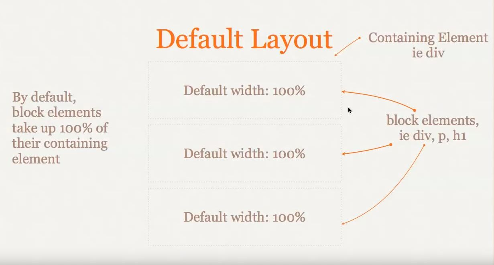
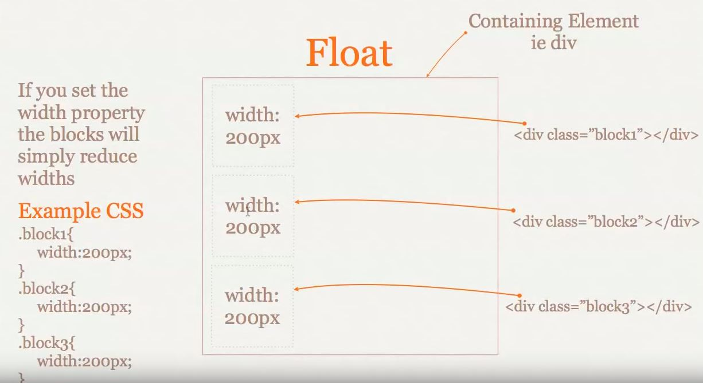
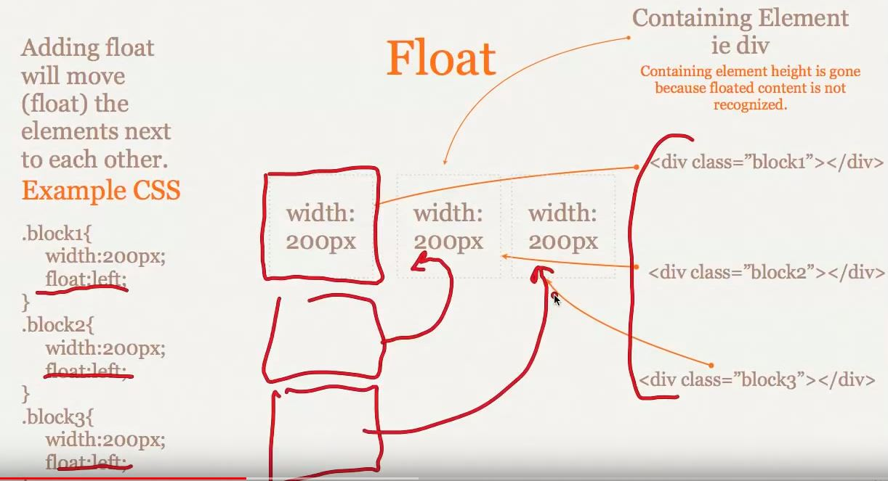
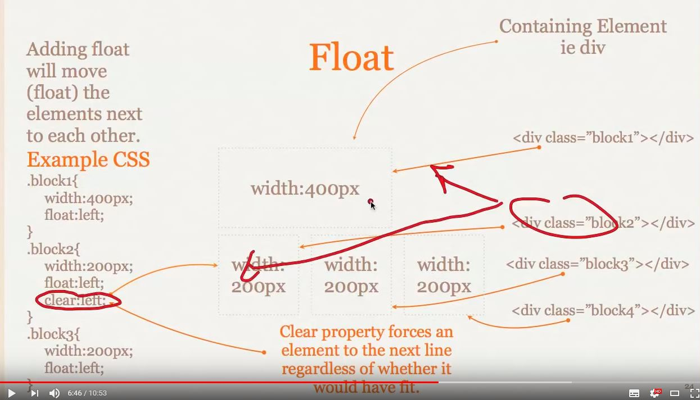
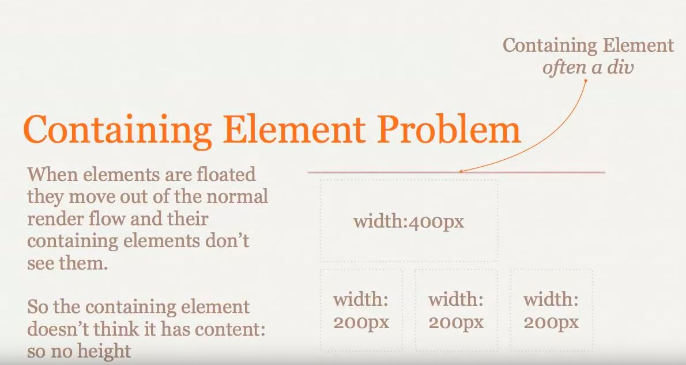
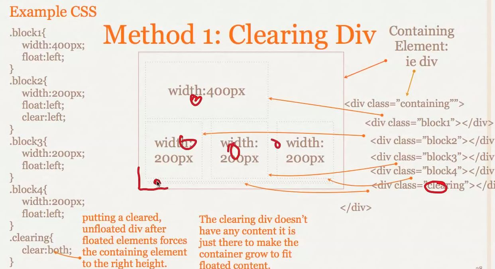
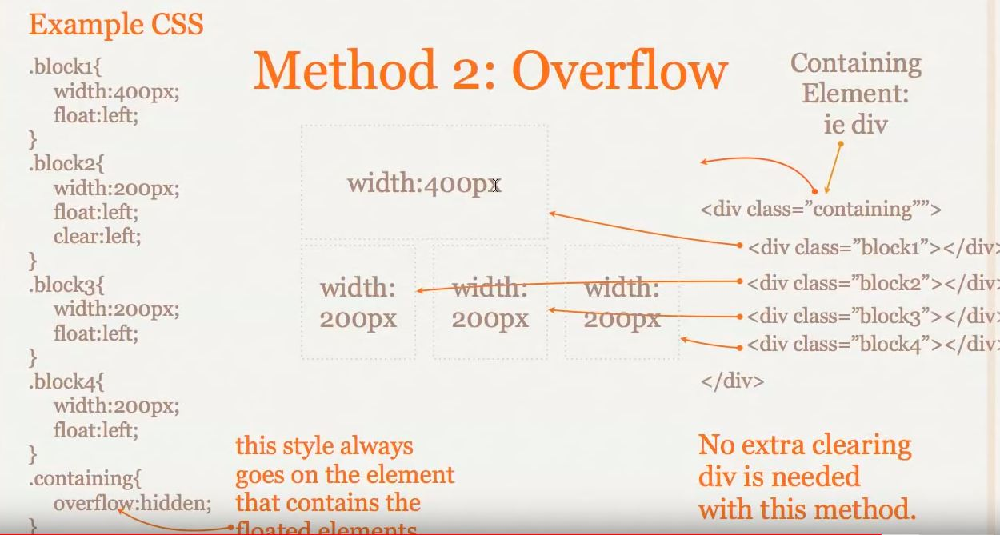

## Float的特性

1. 块级元素在文档流中默认会占据它们的容器的100%宽度

*block element : div、p、h1 and so on*

>默认情况下的布局

>设置块级元素宽度的布局

>添加float属性的布局

>clear属性

2. containing Element Problem

float属性的元素的父级容器默认是没有高度的，所以当需要有特定高度时候，有以下解决办法。

>方法一：添加一个带clear属性的div在末尾

>方法二：给contaning element 添加overflow属性

