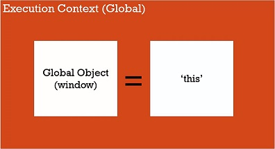
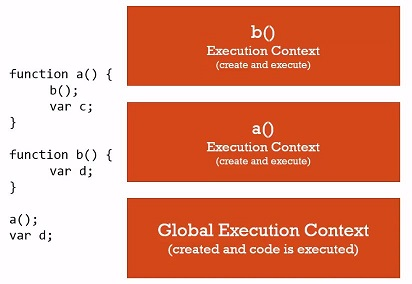
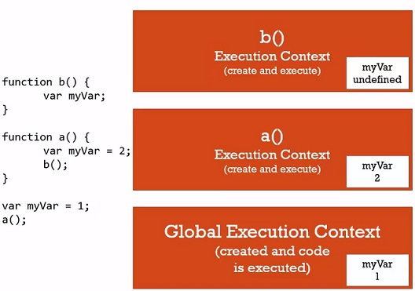
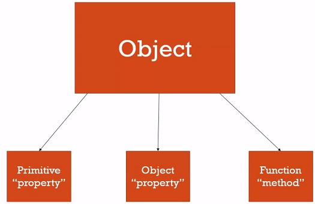
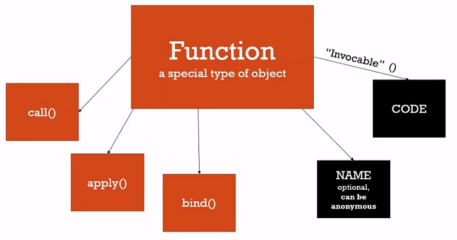

# Execution Contexts and Lexical Environments

## 1 ~  Execution context (Global)

*JavaScrip编译器开始运行你的代码时，就相当于进入了全局环境。此时，编译器会为你做2件事*

>global means 'Not Inside A Funcction'

1.创建一个Global Object

>在浏览器环境里，这个global object是 window 对象

2.创建一个this变量

>this指向window 对象



execution context 定义了变量或函数有权访问的其他数据，每个执行环境都有与之关联的**变量对象（variable object）**
本环境中定义的所有变量和函数都保存在这个对象中。

每个函数都有自己的execution context 和 scope chain，当执行流进入一个函数时，函数的环境就被推入一个环境栈中。执行完毕后，栈将其环境弹出。把控制权交给之前的执行环境。

## 2 ~ The Execution Context - Creation and Hoisting

>函数声明和变量声明总是被JavaScript解释器隐式地提升(hoist)到包含他们的作用域的最顶端

JavaScript解释器会把声明的变量和函数在运行代码之前加进内存

```javascript
var x = 'good';

(function () {
    console.log(x);
    var x = 10; // 在这里添加一行对x的定义
})();


```

这个时候就是变量提升在起作用了，变量提升的定义里说到变量的声明会被提升到其作用域最前端

那就是说我们在这段代码最后一行的var x = 10 被隐式的做出了调整,
var x 实际上被提升到了这段代码所在作用域（也就是这个匿名函数定义的作用域）的最前面，那就相当于这样一段代码：

```javascript
var x = 'good';

(function () {
    var x; // 变量声明被隐式提升
    console.log(x);
    x = 10;
})();

```

** 这个特性在书写javascript代码的时候需要多多注意，
最好将变量声明一类的东西就直接写在其作用域的最开头，这样就不会引发一些不必要的错误 **


## 3 ~ undefined

>undefined在javascript中是一个特殊的值，在Hoisting阶段，var声明的变量都被赋值为undefined

```javascript
var a;

if(a === undefined) {
    console.log('a is undefined');
}
//output --> a is undefined
```


## 4 ~ Code Execution

>JavaScript执行环境创建完毕之后，我们有了一个global object，一个this指向该global object和一个outter reference。之后就开始**line by line**执行代码。

```javascript
function b() {
    console.log('Called b!');
}

console.log(a);
var a = 'Hello World!';
console.log(a);
b();

/*
output -->
    undefined           the first console.log(a);
    Hello World!        the second console.log(a);
    Called b!           invoke function b
*/

```

## 5 ~ Funcction Invocation and Execution Stack

>函数在JavaScript中是通过 ```()``` 来调用。任何时候调用一个函数，一个新的execution context就创建出来。
并处于execution stack的最上层。然后再该context下line by line执行代码。函数执行完毕后，该stack被销毁。
stack遵循first in last out原则。

```JavaScript
function a() {
    b();
    var c
}

function b() {
    var d
}

a();
console.log('executed');
```
上面的代码在执行时，先进入global execution context，把函数声明和变量声明提前并加载如内存，然后开始执行代码，
第一行可执行代码是 ```a()```，调用函数a，并在stack中创建一个执行```a()```的context，之后在```a()```中执行代码，紧接着```b()```被调用，在stack中创建一个执行```b()```的context，```b()```执行完毕后，返回```a()```，从调用函数b的下一行可执行代码开始继续执行。```a()```执行完毕后返回global context，最后执行```console.log('executed')```




## 6 ~ Functions, Context,Variable Enviroments

>*Variable Enviroments* means where the variable live and how they relate to each other in memory

```JavaScript
function b() {
    var myVar;
    console.log('b is ' + myVar);
}

function a() {
    var myVar = 2;
    console.log('a is ' + myVar);
    b();
}

var myVar = 1;
console.log('global is ' + myVar);
a();

/*output -->
global is 1
a is 2
b is undefined
*/
```


## 7 ~ Scope Chain

>一个函数被执行时，会创建一个执行环境（ExecutionContext），函数的所有的行为均发生在此执行环境中，构建该执行环境时，JavaScript 首先会创建 ```arguments```变量，其中包含调用函数时传入的参数。接下来创建作用域链。然后初始化变量，首先初始化函数的形参表，值为 arguments变量中对应的值，如果 ```arguments```变量中没有对应值，则该形参初始化为 ```undefined```。如果该函数中含有内部函数，则初始化这些内部函数。如果没有，继续初始化该函数内定义的局部变量，需要注意的是此时这些变量初始化为 ```undefined```，其赋值操作在执行环境（ExecutionContext）创建成功后，函数执行时才会赋值，最后为 this变量赋值，会根据函数调用方式的不同，赋给 this全局对象，当前对象等。至此函数的执行环境（ExecutionContext）创建成功，函数开始逐行执行，所需变量均从之前构建好的执行环境（ExecutionContext）中读取

>scope chain 本质上是一个指向变量对象的的指针列表，只引用但不包含变量对象。当请求一个变量时，javascript会在当前执行环境中去寻找，如果没有，则去哦outer environment上下文中寻找。一直到global context 中还未找到就抛出错误。

```JavaScript
function b() {
    console.log(myVar);
}

function a() {
    var myVar = 2;
    b();
}

var myVar = 1;
a();

//output --> 1
```

**一个执行上下文的outer environment 取决于此段代码物理上位于何处**


```JavaScript
function a() {
    function b() {
        console.log(myVar);
    }
    var myVar = 2;
    b();
}

var myVar = 1;
a();

//output --> 2
```
>scope : where a variable is available in your code

## 8 ~ Asynchronous Callback


# Types

## 1 ~ Dynamic Typing

>javascript 是一门动态类型语言，只有运行期间才去做数据类型检查，在用动态类型的语言编程时，永远也不用给任何变量指定数据类型，该语言会在你第一次赋值给变

* static Typing
```java
boolean isNew  = 'hello world'; //error
```

* dynamic Typing
```JavaScript
var isNew = true; // no error
isNew = 'hello world';
isNew = 1;
```

## 2 ~ Primitive Types

>javascript中有5中数据类型（也称为基本数据类型）：Undefined、Null、Boolean、Number和String,还有一种复杂数据类型——object,object本质是由一组键值对组成的。

* undefined

undefined类型只有一个值即undefined。对未初始化和未声明的变量执行typeof操作符都会返回undefined，这就说明当我们对一个变量执行typeof操作符时我们不能立即确定这个变量是未初始化还是未声明，因此显示的初始化变量依然是明智的选择，但不应该初始化为undefined

* null

Null类型是第二个只有一个值的数据类型即null。null值表示一个空指针对象，因此typeof操作符检测null值时返回“object”。如果定义的变量将来用于保存对象那么最好将该变量初始化为null而非其他值，这样只要检查null值就可以知道相应的变量是否已经保存了一个对象的引用

* Boolean

Boolean类型有两个字面值：true和false。true不一定等于1，false不一定等于0。需要注意的是true和false是区分大小写的，也就是说True和False（以及其他的混合大小写形式）都不是Boolean值，只是标识符。在javascript中所有类型的值都有与这两个Boolean值等价的值，一个值转换为布尔值可以调用转型函数Boolean()


数据类型|转换为true的值	|转换为false的值
---------|-----------|---------
Boolean	|true	|false
String	|任何非空字符串	|“”（空字符串）
Number	|任何非0数字	|0和NaN
Object	|任何对象	|null
Undefined	|不适用　　	|undefined

* Number

Javascript中保存的都是浮点数。

* String

单引号或双引号所包含的一串字符.

## 3 ~ Operator

>opretor 是一种特殊的函数，语法糖。

* opretor preccedence

当一条语句中有多个操作符时，哪一个会被先执行。换句话说，operator有优先级之分。

* opretor associativity

当优先级一样时，opretor associativity会决定调用顺序（left to right ，right to left）

```javascript
var a = 2, b = 3, c = 4;

a = b = c;

console.log(a);
console.log(b);
console.log(c);

/* output -->
4
4
4
= 操作符的优先级是3，调用顺序是right to left
*/
```

## 4 ~ Coercion

>把变量从一个类型转换成另一个类型，因为JavaScript是动态弱类型语言，类型转换会时常发生

```Javascript
var a  = 1 + '2';
console.log(a);

```

```Javascript
console.log(3 < 2 < 1);

```


```javascript
Boolean(undefined)
//output --> false
Boolean(null)
//output --> false
Boolean("")
//output --> false
Boolean(0)
//output --> false
```

## 5 ~ Default Values

```javascript
function greet(name) {
    console.log('hello ' + name)
}

greet('world'); //hello world
greet();        //hello undefined

function greet1(name) {
    name = name || '<your name here>';
    console.log('hello ' + name)
}

greet1()        //hello <your name here
```
|| 操作符返回一个转boolean为true的变量


## 6 ~ global variable

```html
<html>
    <head>
    </head>
    <body>
        <script src = "lib1.js"></script>
        <script src = "lib2.js"></script>
        <script src = "app.js"></script>
    </body>
</html>
```

在html中引用的lib1和lib2中如果有同名变量，因为lib2位于lib1之后，会覆盖lib1中的变量。

>javascript engine 会把3个引用的库文件当作一个文件来运行。所以如果不做好变量隔离，很可能会导致变量冲突。

# Objects and Functions

## 1 ~ Objects and the Dot

>对象就是一组“键值对”（key-value）的集合，是一种无序的复合数据集合。

对象中的值可以是基础类型数据和引用类型数据（在object中称作property）和函数（在对象中称作method）



```javascript
var car1 = new Object();

car1["model"] = 'BMW';

car1.address = new Object();
car1.address.city = 'Shenyang';

var car2 = {
    model: 'Volkswagen',
    address: {
        city: 'Changchun',
    }
};
```

## 2 ~ Functions are Objects

>javascript 中函数是第一等公民，对其他数据类型能做的操作同样对函数也能做。可以把函数赋值给变量，当作参数传递进另一个函数，运行时创建。


## 3 ~ by value vs by reference

>传值调用本质上传递的是变量的值的拷贝。传共享调用本质上是传递对象的指针的拷贝，其指针也是变量的值。所以传共享调用也可以说是传值调用。
* 基本类型是传值调用
* 引用类型传共享调用

```javascript
function changeStuff(a, b, c) {
  a = a * 10;
  b.item = "changed";
  c = {item: "changed"};
}

var num = 10;
var obj1 = {item: "unchanged"};
var obj2 = {item: "unchanged"};

changeStuff(num, obj1, obj2);

console.log(num);
console.log(obj1.item);    
console.log(obj2.item);
```

代码分析

step1 : 变量初始化
```javascript
var num = 10;
var obj1 = {item: "unchanged"};
var obj2 = {item: "unchanged"};
```


step2 : 调用函数
```javascript
changeStuff(num, obj1, obj2);
```


>可以看到，变量 ```a``` 的值就是 ```num``` 值的拷贝，变量 ```b``` ```c``` 分别是 ```obj1``` ```obj2``` 的指针的拷贝。
* 函数的参数其实就是函数作用域内部的变量，函数执行完之后就会销毁。

step3 : 执行函数体
```javascript
a = a * 10;
b.item = "changed";
c = {item: "changed"};
```


如图所示，变量 ```a``` 的值的改变，并不会影响变量 ```num```。

而 ```b``` 因为和 ```obj1``` 是指向同一个对象，所以使用 ```b.item = "changed";``` 修改对象的值，会造成 ```obj1``` 的值也随之改变。

由于是对 ```c``` 重新赋值了，指向了新对象的内存地址，所以修改 ```c``` 的对象的值，并不会影响到 ```obj2```。

## 4 ~ this

>当一个函数被调用，新的执行上下文也同时被创建，同时一个this会传给函数。函数里面的this的指向，是由它被调用的方式决定的，而不是这个函数所在的作用域
* 方法调用-->函数中的this指向该函数所属的对象
* 函数调用-->在非严格模式下，this绑定到全局对象，否则为undefined
* 构造函数--> 构造函数this指向新创建的对象
* call,apply,bind-->this指向传入的对象

*方法调用*
```javascript
var car = {
    model: 'BMW',
    type: 'X3',
    getInfo: function() {
        var info = this.model + ' ' + this.type;
        return info;
    }
}

car.getInfo();
/* output --> BMW X3
 *
 * this指向方法所属对象
 */
```

*函数调用*
```javascript
function getInfo(model, type) {
    return this.model + ' ' + this.type;
}

var model = 'BMW', type = 'X1';

getInfo('Baojun', '510');
/* output --> BMW X1
 *
 * this指向方法全局对象
 */
```

*call,apply,bind显式调用*

>再一次重申，在 JavaScript 中函数也是对象，对象则有方法，apply 和 call 就是函数对象的方法。这两个方法异常强大，他们允许切换函数执行环境（exrcution context），即 this 绑定的对象



```javascript
var car = {
    model: 'BMW',
    type: 'X3',
    getInfo: function() {
        var info = this.model + ' ' + this.type;
        return info;
    }
}

var logInfo = function(model, type) {
    console.log(this.getInfo());
}

var logCarInfo = logInfo.bind(car);
logCarInfo();   //output-->BMW X3
//logInfo();
logInfo.call(car);
logInfo.apply(car);
logInfo.bind(car);

```

```javascript
//use of apply or call
var car1 = {
    model: 'BMW',
    type: 'X3',
    getInfo: function() {
        var info = this.model + ' ' + this.type;
        return info;
    }
}

var car2 = {
    model: 'Benz',
    type: 'C200',
}

var result = car1.getInfo.apply(car2);

console.log(result);
```

```javascript
//use of bind
function mutiply(a, b) {
    return a * b;
}

var mutipleByTwo = mutiply.bind(this, 2) //2 is set for the first parameter
var result = mutipleByTwo(4);

console.log(result);
```
## 5 ~ Immediately Invoked Functions Expressions

**自执行函数出现有两个作用：**

>* 页面加载时需要做一些设置工作，如初始化操作，这些工作没必要重复执行，因此不需要一个有名字的复用函数
* 做这些工作有时需要用到一些变量，这些变量不能污染全局作用域

```javascript
// function statement
function greet(name) {
    console.log('Hello ' + name);   
}
greet('John');

// using a function expression
var greetFunc = function(name) {
    console.log('Hello ' + name);
};
greetFunc('John');

// using an Immediately Invoked Function Expression (IIFE)
var greeting = function(name) {

    return 'Hello ' + name;

}('John');

console.log(greeting);

// IIFE
var firstname = 'John';

(function(name) {

    var greeting = 'Inside IIFE: Hello';
    console.log(greeting + ' ' + name);

}(firstname)); // IIFE
```

IIFE中创建的greeting和全局中的greeting互不冲突


## 6 ~ Closure

>```闭包```是指有权访问另一个函数作用域中的变量的函数，创建闭包的最常见的方式就是在一个函数内创建另一个函数，通过另一个函数访问这个函数的局部变量

闭包有三个特性：
```
1. 函数嵌套函数
2. 函数内部可以引用外部的参数和变量
3. 参数和变量不会被垃圾回收机制回收
```

```javascript
function greet(whattosay) {

   return function(name) {
       console.log(whattosay + ' ' + name);
   }
}

var sayHi = greet('Hi ');
sayHi('Tony');

//output-->Hi Tony
```

# Object-Oriented

## 1 ~ Prototype

> 我们创建的每一个函数都有一个prototype属性，这个属性是一个指针，指向一个对象，这个对象的用途是包含特定类
型的所有实例共享的属性和方法。


## 2 ~ new

>使用new命令时，它后面的函数调用就不是正常的调用，而是依次执行下面的步骤。
	1. 创建一个空对象，作为将要返回的对象实例
	2. 将这个空对象的原型__proto__属性，指向构造函数的prototype属性
	3. 将这个空对象赋值给函数内部的this关键字
	4. 开始执行构造函数内部的代码

```javascript
function Car() {
    this.model = 'BMW';
    this.type  = 'X1';
}

var myCar = new Car();
console.log(myCar);
```

当```var myCar = new Car()``` 的时候，做了什么？用伪代码表示如下


```javascript
var obj = {};
    //创建一个空对象
obj.__proto__ = Car.prototype;
    //将obj的原型__proto__属性，指向构造函数的prototype属性
var result = Car.call(obj);
    //将obj赋值给函数内部的this关键字
return typeof result === 'obj'? result : obj;
    //检查第3步返回的返回值，如果无返回值或者返回一个非对象值，则将obj返回作为新对象；否则会将返回值作为新对象返回
```

prototype的应用
```javascript
function Car(model, type) {
    this.model = model;
    this.type  = type;
}

Car.prototype.getInfo = function() {
    return this.model + ' ' + this.type;
}

var myCar1 = new Car('BMW', 'X1');
var myCar2 = new Car('Benz', 'C200');

console.log(myCar1.getInfo());
console.log(myCar2.getInfo());
```

可以看出，在原型对象上增加的方法被所有实例共享了，这样做既省略了代码，有节约了内存。而各自对象还保有自己独立的属性。
